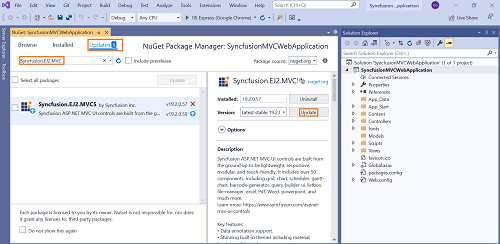
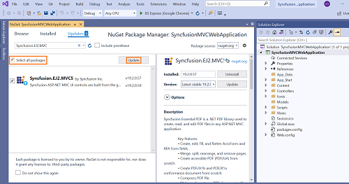
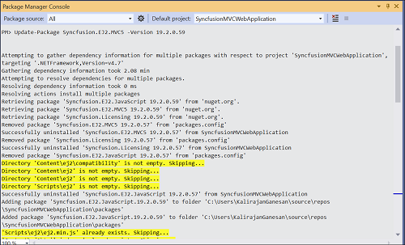

# Upgrading Syncfusion ASP.NET MVC JS2 NuGet packages to a latest version

Every three months, Syncfusion releases new volumes with interesting new features. For this volume, there will be weekly NuGet releases and a service pack. Syncfusion ASP.NET MVC JS2 NuGet packages are released on a weekly basis to address critical issue fixes.

From any Syncfusion ASP.NET MVC JS2 NuGet version you have installed; you can update to our most recent version.

## Upgrade NuGet packages through Package Manager UI

The NuGet **Package Manager UI** in Visual Studio allows you to easily install, uninstall, and update NuGet packages in applications and solutions. You can find and upgrade the Syncfusion ASP.NET MVC JS2 NuGet packages to the most recent version or to specific version in the ASP.NET MVC solution or application and this process is easy with the steps below:

1. Right-click on the ASP.NET MVC application or solution in the Solution Explorer tab, and choose **Manage NuGet Packages...**

    

    As an alternative, after opening the ASP.NET MVC application in Visual Studio, go to the **Tools** menu and after hovering **NuGet Package Manager**, select **Manage NuGet Packages for Solution...**

2. The Manage NuGet Packages window will open. Navigate to the **Updates** tab, then search for the Syncfusion ASP.NET MVC JS2 NuGet packages using a term like **"Syncfusion"** and select the appropriate Syncfusion ASP.NET MVC JS2 NuGet package for your application.

    > The [nuget.org](https://api.nuget.org/v3/index.json) package source is selected by default in the Package source drop-down. If your Visual Studio does not have nuget.org configured, follow the instructions in the [Microsoft documents](https://docs.microsoft.com/en-us/nuget/tools/package-manager-ui#package-sources) to set up the nuget.org feed URL.

3. By default, the package selected with latest version. You can select the required version and click the **Update** button and accept the license terms. The package will be upgraded to selected version in your ASP.NET MVC application.

    

    You can choose the multiple NuGet packages by selecting the checkbox like below and click the **Update** button to update the multiple Syncfusion NuGet packages in your application.

    

## Upgrade NuGet packages through Package Manager Console

The **Package Manager Console** saves NuGet packages upgrade time since you don't have to search for the package you want to update, and you can just type the command to update the appropriate Syncfusion ASP.NET MVC JS2 NuGet package. Follow the steps below to upgrade the installed Syncfusion NuGet packages using the Package Manager Console in your ASP.NET MVC application.

1. To show the Package Manager Console, open your ASP.NET MVC application in Visual Studio and navigate to **Tools** in the Visual Studio menu and after hovering **NuGet Package Manager**, select **Package Manager Console**.

    

2. The Package Manager Console will be shown at the bottom of the screen. You can install the Syncfusion ASP.NET MVC JS2 NuGet packages by enter the following NuGet update commands.

    ***Update specified Syncfusion ASP.NET MVC JS2 NuGet package***

    The below command will update the Syncfusion ASP.NET MVC JS2 NuGet package in the default ASP.NET MVC application.

    ```Update-Package <Package Name>```

    **For example:** Update-Package Syncfusion.EJ2.MVC5

    ***Update specified Syncfusion ASP.NET MVC JS2 NuGet package in specified ASP.NET MVC application***

    The below command will update the Syncfusion ASP.NET MVC JS2 NuGet package in the given ASP.NET MVC Web application alone.

    ```Update-Package <Package Name> -ProjectName <Project Name>```

    **For example:** Update-Package Syncfusion.EJ2.MVC5 -ProjectName SyncfusionMVCWebApplication

3. By default, the package will be installed with latest version. You can give the required version with the -Version term like below to install the Syncfusion ASP.NET MVC JS2 NuGet packages in the appropriate version.

    ```Update-Package Syncfusion.EJ2.MVC5 -Version 19.2.0.59```

    

4. The Syncfusion ASP.NET MVC JS2 NuGet package, as well as its dependencies, will be updated by the NuGet package manager.