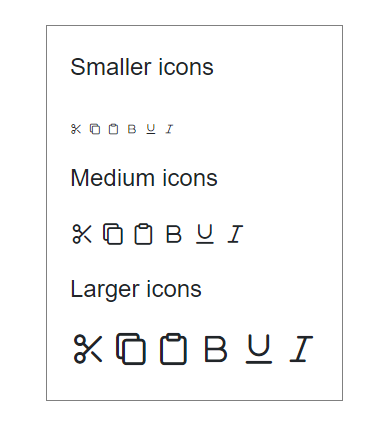

# Icons Library

The Syncfusion Essential JS 2 provides the set of `base64` formatted font icons, that can be utilized in the ASP.NET Core application.

## Icons Size

You can change the icon size by adding `e-small`, `e-medium` and `e-large` class in the HTML element.

* When icon size set to Small, the font size will be `8px`.
* When icon size set to Medium, the font size will be `16px`.
* When icon size set to Large, the font size will be `24px`.




Smaller icons

Medium icons

Larger icons




## Tooltip for icons

`title` attribute is used to improve accessibility with screen readers and shows a tooltip on mouseover. The following example code displays tooltip text for appropriate icons.







## Icon appearance customization 

You can customize color and size by overriding the `e-icons` class. The following example code demonstrates the custom font-size and color for icons.







## Third party icons integration

The Syncfusion ASP.NET core Toolbar component supports to render custom font icons using the [prefixIcon](https://help.syncfusion.com/cr/aspnetcore-js2/Syncfusion.EJ2.Navigations.ToolbarItem.html#Syncfusion_EJ2_Navigations_ToolbarItem_PrefixIcon) property. To render custom font icons define the required font CSS that provides the required font name, font size, and content for the icon.

The following code explains how to render `open-iconic` icons using `prefixIcon` property.




    <ejs-toolbar id="defaultToolbar">
        <e-toolbar-items>
            <e-toolbar-item prefixIcon="oi oi-list-rich"></e-toolbar-item>
            <e-toolbar-item prefixIcon="oi oi-account-login"></e-toolbar-item>
            <e-toolbar-item prefixIcon="oi oi-account-logout"></e-toolbar-item>
            <e-toolbar-item prefixIcon="oi oi-action-redo"></e-toolbar-item>
            <e-toolbar-item prefixIcon="oi oi-action-undo"></e-toolbar-item>
            <e-toolbar-item prefixIcon="oi oi-clock"></e-toolbar-item>
            <e-toolbar-item prefixIcon="oi oi-audio"></e-toolbar-item>
            <e-toolbar-item prefixIcon="oi oi-bluetooth"></e-toolbar-item>
        </e-toolbar-items>
    </ejs-toolbar>




## HTML attribute support

You can add the additional HTML attributes to the Syncfusion ASP.NET Core Button using [HtmlAttributes](https://help.syncfusion.com/cr/aspnetcore-js2/Syncfusion.EJ2.Buttons.Button.html#Syncfusion_EJ2_Buttons_Button_HtmlAttributes) property. All syncfusion ASP.NET Core components support HTML attribute.

The following example shows the font size customization using `HtmlAttributes` directive.




@{IDictionary<string, object> customAttribute = new Dictionary<string, object>()
    {
       { "style", "font-size: 20px" }
    };
}

<ejs-button id="button" iconCss="e-icons e-copy" HtmlAttributes="customAttribute"></ejs-button>




## Using icons directly in HTML element

The built-in Syncfusion icons can be rendered directly in the HTML element by defining `e-icons` class that contains the font-family and common property of font icons, and defining the [available icon's](#icons-list) class with `e-` prefix. 

The following code example explains the direct rendering of Syncfusion `download` icon in the span element.







## Icons list

The complete pack of Syncfusion ASP.NET Core icons is listed in the following table. The corresponding icon content can be referred to the content section.

<!-- markdownlint-disable MD033 -->

### Bootstrap 5

<iframe class="doc-sample-frame" src="https://ej2.syncfusion.com/products/icons/bootstrap5/demo.html" style="height:1000px;width:100%;"></iframe>

### Bootstrap 4

<iframe class="doc-sample-frame" src="https://ej2.syncfusion.com/products/icons/bootstrap4/demo.html" style="height:1000px;width:100%;"></iframe>

### Bootstrap

<iframe class="doc-sample-frame" src="https://ej2.syncfusion.com/products/icons/bootstrap/demo.html" style="height:1000px;width:100%;"></iframe>

### Material

<iframe class="doc-sample-frame" src="https://ej2.syncfusion.com/products/icons/material/demo.html" style="height:1000px;width:100%;"></iframe>

### Tailwind CSS

<iframe class="doc-sample-frame" src="https://ej2.syncfusion.com/products/icons/tailwind/demo.html" style="height:1000px;width:100%;"></iframe>

### Office Fabric

<iframe class="doc-sample-frame" src="https://ej2.syncfusion.com/products/icons/fabric/demo.html" style="height:1000px;width:100%;"></iframe>

### High Contrast

<iframe class="doc-sample-frame" src="https://ej2.syncfusion.com/products/icons/highcontrast/demo.html" style="height:1000px;width:100%;"></iframe>
