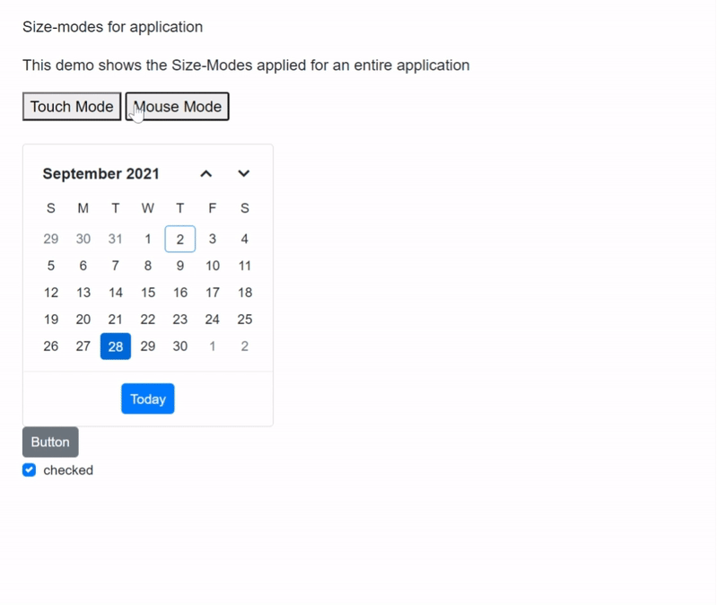

# Size Mode for ASP.NET Core Components

Syncfusion ASP.NET Core components support touch (bigger theme) and normal size modes. Below topics explains how to enable the same in your application.

## Size mode for application

You can enable touch mode (bigger theme) for an application by adding `.e-bigger` class in the `~/wwwroot/css/site.css` file and assign to the `body` element in the `Pages/Shared/_Layout.cshtml` page.




    .e-bigger {
      font-size: x-large;
    }







<body class="e-bigger">...</body>




## Size mode for a Component

You can enable touch mode (bigger theme) for ASP.NET Core components by adding `.e-bigger` class and assign to the `div` which contains the component.




    

        <ejs-calendar id="calendar"></ejs-calendar>
    

    

        <ejs-button id="element" content="Button"></ejs-button>

    

    

        <ejs-checkbox id="default" label="Checked" checked="true"></ejs-checkbox>
    

    




## Change size mode for application at runtime

You can change the size mode of an application between touch and normal (mouse) mode at runtime by adding and removing the `.e-bigger` class.

Follow the below steps to change the size mode for an application at runtime.

1. Add the `e-bigger` CSS class in the `~/wwwroot/css/site.css` file.




    .e-bigger {
      font-size: x-large;
    }




2. Refer to the following code for adding component and the JavaScript click action inside the script tag of `Pages/index.cshtml` file to switch between touch and mouse mode using `e-bigger` class.




    
 Size-modes for application 

    
 This demo shows the Size-Modes applied for an entire application 

    <button id="touch">Touch Mode</button>
    <button id="mouse">Mouse Mode</button>

    

    <ejs-calendar id="calendar"></ejs-calendar>
    

    

    <ejs-button id="element" content="Button"></ejs-button>
    

    

    <ejs-checkbox id="default" label="Checked" checked="true"></ejs-checkbox>
    

    




## Change size mode for a component at runtime

You can change the size mode of a component between touch and normal (mouse) mode at runtime by setting `.e-bigger` CSS class.  

Refer to the following code, in which the `e-bigger` class is added for enabling touch mode using the for loop in ASP.NET core application.




    
 Size-modes for application 

    
 This demo shows the Size-Modes applied for an entire application 

    <button id="touch">Touch Mode</button>
    <button id="mouse">Mouse Mode</button>

    

    <ejs-calendar id="calendar"></ejs-calendar>
    

    

    <ejs-button id="element" content="Button"></ejs-button>
    

    

    <ejs-checkbox id="default" label="Checked" checked="true"></ejs-checkbox>
    

    

    




## See Also

Refer below topics to learn about responsiveness components based on the available size in Syncfusion ASP.NET Core Components.

* [Sidebar Responsiveness](https://ej2.syncfusion.com/aspnetcore/documentation/sidebar/auto-close/)
* [DataGrid Responsiveness](https://ej2.syncfusion.com/aspnetcore/documentation/grid/Columns/responsive-columns/)
* [TreeGrid Responsiveness](https://ej2.syncfusion.com/aspnetcore/documentation/tree-grid/scrolling/#responsive-with-parent-container)
* [Dashboard Layout Responsiveness](https://ej2.syncfusion.com/aspnetcore/documentation/dashboard-layout/adaptive-layout/)
* [Kanban Responsiveness](https://ej2.syncfusion.com/aspnetcore/documentation/kanban/responsive-mode/)
* [Toolbar Responsiveness](https://ej2.syncfusion.com/aspnetcore/documentation/toolbar/responsive-mode/)
* [Tab Responsiveness](https://ej2.syncfusion.com/aspnetcore/documentation/tab/responsive-modes/)
