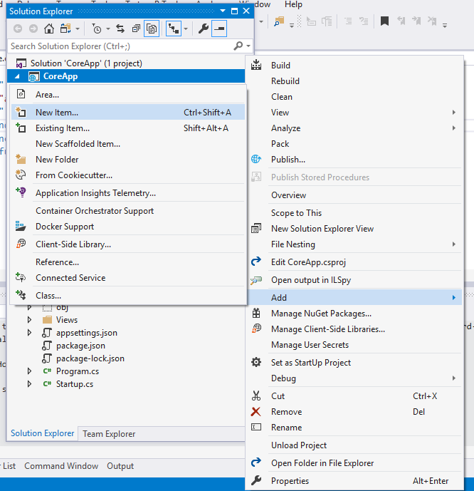
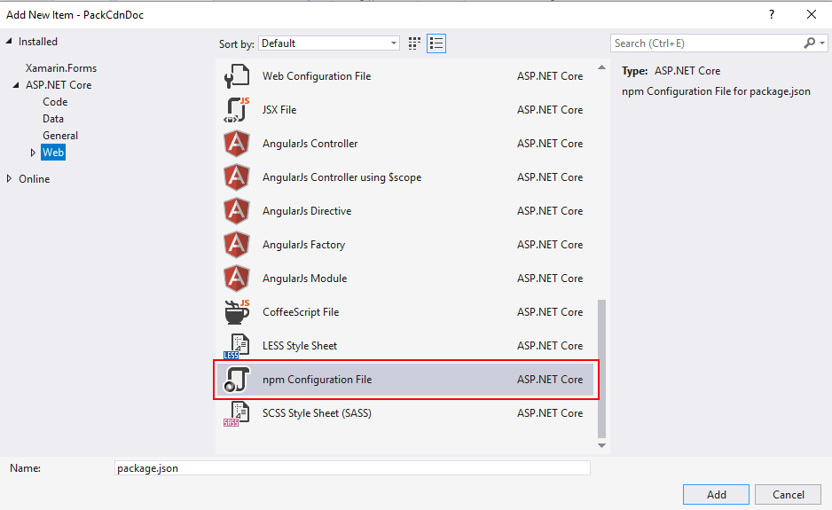
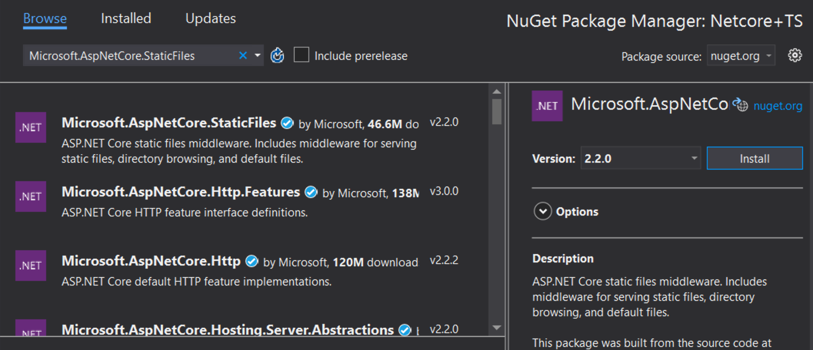
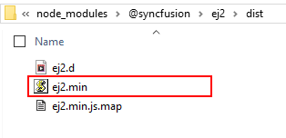
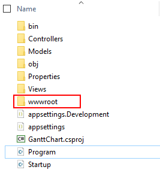
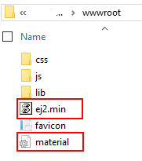
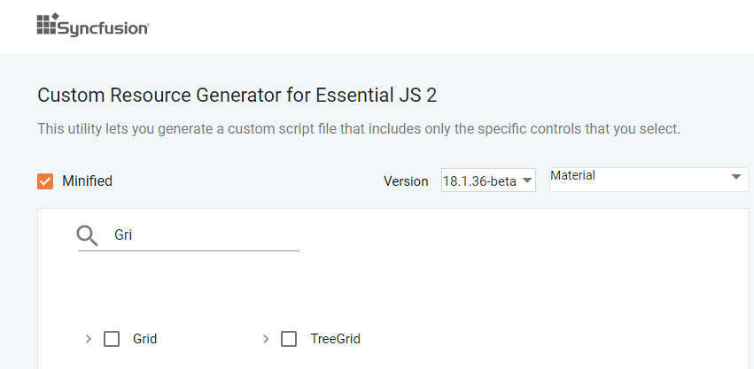

# Including Client-Side Resources

This article provides the details extensively about all the possible ways of including the client-side resources of Syncfusion EJ2 Components in an ASP.NET Core web application. 

## From Content Delivery Network (CDN)

CDN is a group of servers which are geographically distributed and work together to enhance the speed of content delivery. The type of content might vary from simple script files and cascading style sheets to complex JSON data files, images, videos, etc.

Improved website loading time, reduced bandwidth in website hosting, development without any installation are some of the benefits of the CDN reference in a web application.

### Syncfusion EJ2 CDN

Syncfusion hosts every EJ2 component as a separate node package in CDN, from which scripts and style sheets of the individual package can be loaded. Syncfusion also hosts a single node package with all EJ2 Components on it, from which scripts and style sheets of all the EJ2 components can be loaded as single script and style file. 

Here, the generic syntax of the Syncfusion EJ2 CDN URL for the both Individual EJ2 Component package and Complete EJ2 Component package has been explained.

>Throughout this article, **EJ2 Component** refers to **Individual EJ2 Component** package, and **EJ2** refers to **Complete EJ2 Component package**.

**Syntax:**
>EJ2 Component Script Files: https://cdn.syncfusion.com/ej2/{PACKAGE-NAME}/dist/global/{PACKAGE-NAME}.min.js
>
>EJ2 Component Style Sheets: https://cdn.syncfusion.com/ej2/{PACKAGE-NAME}/styles/{THEME-NAME}.css
>
>EJ2 Script Files: https://cdn.syncfusion.com/ej2/dist/ej2.min.js
>
>EJ2 Style Sheets: https://cdn.syncfusion.com/ej2/{THEME-NAME}.css

**Example:**
>EJ2 Component Script Files: https://cdn.syncfusion.com/ej2/ej2-buttons/dist/global/ej2-buttons.min.js
>
>EJ2 Component Style Sheets: https://cdn.syncfusion.com/ej2/ej2-buttons/styles/material.css
>
>EJ2 Script Files: https://cdn.syncfusion.com/ej2/dist/ej2.min.js
>
>EJ2 Style Sheets: https://cdn.syncfusion.com/ej2/material.css

#### Using EJ2 CDN

The primary goal of EJ2 package is to help the novice to get started with Syncfusion EJ2 by referring the single line for script and styles without bothering about the dependency graph of the EJ2 components.

> Syncfusion will never recommend EJ2 CDN for real-time projects. Because, the size of EJ2 CDN impacts website/app loading time since this package includes all the EJ2 components.

Add the EJ2 CDN client-side resources to the `<head>` element of the `~/Views/Shared/_Layout.cshtml` layout page.

```html
<head>
    ....
    ....

    <!-- Syncfusion Essential JS 2 Styles -->
    <link rel="stylesheet" href="https://cdn.syncfusion.com/ej2/material.css" />

    <!-- Syncfusion Essential JS 2 Scripts -->
    <script src="https://cdn.syncfusion.com/ej2/dist/ej2.min.js"></script>
</head>

```
#### Using EJ2 Component CDN

The primary goal of EJ2 Component package CDN is to optimize the loading time and memory of the website/app in the production stage. The order of EJ2 Component package loading should be in line with its dependency graph. The CDN of the Dependency Packages should be included manually before the intended EJ2 Component package CDN.

Add the CDN client-side resources in the `<head>` element of the `~/Views/Shared/_Layout.cshtml` layout page.

```html
<head>

    ...

    ...

        <!-- Syncfusion Essential JS 2 Styles -->
        <link rel="stylesheet" href="https://cdn.syncfusion.com/ej2/ej2-calendars/styles/material.css" />
        <link rel="stylesheet" href="https://cdn.syncfusion.com/ej2/ej2-base/styles/material.css" />
        <link rel="stylesheet" href="https://cdn.syncfusion.com/ej2/ej2-buttons/styles/material.css" />
        <link rel="stylesheet" href="https://cdn.syncfusion.com/ej2/ej2-popups/styles/material.css" />
        <link rel="stylesheet" href="https://cdn.syncfusion.com/ej2/ej2-lists/styles/material.css" />


        <!-- Syncfusion Essential JS 2 Scripts -->
        <script src="https://cdn.syncfusion.com/ej2/ej2-base/dist/global/ej2-base.min.js"></script>
        <script src="https://cdn.syncfusion.com/ej2/ej2-buttons/dist/global/ej2-buttons.min.js"></script>
        <script src="https://cdn.syncfusion.com/ej2/ej2-popups/dist/global/ej2-popups.min.js"></script>
        <script src="https://cdn.syncfusion.com/ej2/ej2-lists/dist/global/ej2-lists.min.js"></script>
        <script src="https://cdn.syncfusion.com/ej2/ej2-calendars/dist/global/ej2-calendars.min.js"></script>
</head>
```

## From Node Package Manager (NPM)

A package in Node.js consists of a set of files needed for a JavaScript module which can be included in any web application. NPM is the popular package manager for both public and private packages.

### Syncfusion NPM packages

Scripts and style sheets of Syncfusion EJ2 Components can be included in an ASP.NET Core web application using NPM packages, since Syncfusion publishes its EJ2 Components as the scoped package in NPM.

#### Installing NPM packages in ASP.NET Core Web Application

1. Open the Source Explorer and right click the application name. Then, select “**Add New Item**” menu item to open the “**Add New Item**” window. 

    

2. Select “**Web**” on the left side Tree View and select “**npm configuration File**” in “**Add New Item**” window which will include and configure “**package.json**” file in root folder of the ASP.NET Core web application. 

    

3. Open the Source Explorer and right click on the application name. Then, select “**Open Folder in File Explorer**”. 

4. Open the Command Prompt for this location and install the required Syncfusion packages using “**npm install @syncfusion/{PACKAGE_NAME} --save**”

    

5. Installed packages with all its dependencies can be found under the  “**node_modules**” folder as shown in the following image.

    

#### From Installed Packages

Scripts and style sheets of Syncfusion EJ2 Components from locally-installed packages can be included in an ASP.NET Core web application using the following two methods.

>Files in the **wwwroot** folder can be accessed only in client-side, hence Syncfusion scripts and style sheets should be copied from **node_modules** to **wwwroot**.

By using either one of the following methods, Client-Side Resource can be loaded in ASP.NET Core web application:

1. Copying scripts and styles using gulp
2. Generating scripts and styles using CRG (Custom Resource Generator)

#### Copying by Gulp

Install required Syncfusion EJ2 Component packages as mentioned in “[**Installing NPM Packages in ASP.NET Core Web Application**](#installing-npm-packages-in-aspnet-core-web-application)”. 

1. In addition to Syncfusion EJ2 packages, install gulp and glob packages using below commands.

>Gulp Installation - **npm install gulp --save**
>
>
>
>Glob Installation - **npm install glob --save**
>
>

2. To set up the server, open Dependencies -> Manage NuGet Packages -> Browse. Then, search and install "**Microsoft.AspNetCore.StaticFiles**" and "**Microsoft.TypeScript.MSBuild**" packages.

    
     
Open up your "**Startup.cs**" file and edit your Configure function to looks like the below code snippet.

```js

public void Configure(IApplicationBuilder app, IHostingEnvironment env)
{
    if (env.IsDevelopment())
    {
        app.UseDeveloperExceptionPage();
    }

    app.UseDefaultFiles();
    app.UseStaticFiles();
}

```
Restart Visual Studio for the red squiggly lines below "**UseDefaultFiles**" and "**UseStaticFiles**" to disappear.

3. Open the Source Explorer and right click on the application name. Then, select “**Add New Item**” menu item to open the “**Add New Item**” window. 

4. Select “**ASP.NET Core**” on the left side Tree View and select “**JavaScript File**” in the “**Add New Item**” window. It will include a js file in the root folder of the ASP.NET Core web application. Rename the js file as “**gulpfile.js**”.

    

5. Copy the following code snippet and paste it in gulpfile.js for automatically copying the script and styles from “**node_modules**” to “**wwwroot**” while building the web application. 

```js

/// <binding BeforeBuild='copy-client-resource'/>

// nodejs requiring statement for importing and using the package in this js file
var gulp = require('gulp');
var glob = require('glob');


// gulp task for copying file form “node_modules” to “wwwroot” directory
gulp.task("copy-client-resource", function (done) {
    let packagePath = './node_modules/@syncfusion/';
    let destCommonPath = 'wwwroot/syncfusion'
    let installedPackages = glob.sync(`${packagePath}*`);
    for (let insPackage of installedPackages) {
        let packagename = insPackage.replace(packagePath, '');
        gulp.src(`${insPackage}/dist/global/**/*`)
            .pipe(gulp.dest(`${destCommonPath}/${packagename}/`));
        gulp.src(`${insPackage}/styles/**/*.css`)
            .pipe(gulp.dest(`${destCommonPath}/${packagename}/styles/`));
    }
    done();
});
```

6. Build the ASP.NET Core web application and notice that a new folder named “**Syncfusion**” is created in “**wwwroot**” folder.

    

7. Add the client-side resource in the `<head>` element of the `~/Views/Shared/_Layout.cshtml`. Here, scripts and styles of Syncfusion EJ2 Calendar has been loaded for example.  

```html
<head>


….

….
        <!-- Syncfusion Essential JS 2 Styles -->
        <link rel="stylesheet" href="~/syncfusion/ej2-calendars/styles/calendar/material.css" />
        <link rel="stylesheet" href="~/syncfusion/ej2-base/styles/material.css" />
        <link rel="stylesheet" href="~/syncfusion/ej2-buttons/styles/button/material.css" />
        <link rel="stylesheet" href="~/syncfusion/ej2-popups/styles/popup/material.css" />
        <link rel="stylesheet" href="~/syncfusion/ej2-lists/styles/list-view/material.css" />


        <!-- Syncfusion Essential JS 2 Scripts -->
        <script src="~/syncfusion/ej2-base/ej2-base.min.js"></script>
        <script src="~/syncfusion/ej2-buttons/ej2-buttons.min.js"></script>
        <script src="~/syncfusion/ej2-popups/ej2-popups.min.js"></script>
        <script src="~/syncfusion/ej2-lists/ej2-lists.min.js"></script>
        <script src="~/syncfusion/ej2-calendars/ej2-calendars.min.js"></script>
</head>
```

#### Generating from Custom Resource Generator (CRG)

Syncfusion provides an online web tool named [Custom Resource Generator (CRG)](https://crg.syncfusion.com/) to generate scripts (JavaScript ES5) and styles for needed EJ2 Components by selecting it from the list of Syncfusion EJ2 Component.

1.	Detailed step-by-step information to generate scripts and styles for required EJ2 components can be found from [CRG Documentation](https://ej2.syncfusion.com/javascript/documentation/common/custom-resource-generator).
2.	Generate and download the custom scripts and styles from CRG. 
3.	Extract the downloaded custom scripts and styles into “**wwwroot**” folder of the ASP.NET Core Web Application. 
4.	Add the client-side resource in the `<head>` element of the `~/Views/Shared/_Layout.cshtml`. 

## Offline Setup with Syncfusion EJ2 Components

This part of article provides information on setting up ASP.NET Core Web application development environment with Syncfusion Essential JS2 for ASP.NET Core without internet connection. Instead of having a well-connected internet, you may need to set up / start your application development in an isolated intranet to protect data from security attacks. 

### Downloading Client Side Resources of Essential JS 2 for ASP.NET Core

The required script and style files could be downloaded either form npm packages or Custom Resource Generator (CRG) utilitity site. 

#### From NPM packages

1. Run the below command from the machine which has internet connection to install the `@syncfusion/ej2` package.

   ```sh

   npm i @syncfusion/ej2 

   ```
2. Navigate to the `./node_modules/@syncfusion/ej2/dist/` then copy the `ej2.min.js` file to your desired location. 

   

3. Navigate to the `./node_modules/@syncfusion/ej2/` then copy the theme wise CSS style files to desired location.

   

4. Copy these script and style files to the machine which is connected to an isolated network. 

5. Then, navigate to `wwwroot` directory of  ASP.NET Core application and paste the copied files from `@syncfusion/ej2` package.

   

   

6. Refer the script and style in `<head>` sectoin of `~/Views/Shared/_Layout.cshtml` file.

   

#### From Custom Resource Generator (CRG)

From [CRG](https://ej2.syncfusion.com/aspnetcore/documentation/common/custom-resource-generator/), we can generate scripts and styles for the required Essential JS 2 for ASP.NET Core components by selcting from the component list to improve the performance.

1. Open the [CRG](https://crg.syncfusion.com/) utility site and select required component to generate the script and style files.

   

2. Extract the downloaded script into `wwwroot` directory of the ASP.NET Core web application which is connected with isolated intranet.  

   

3. Refer the script and style in `<head>` sectoin of `~/Views/Shared/_Layout.cshtml` file.

   
