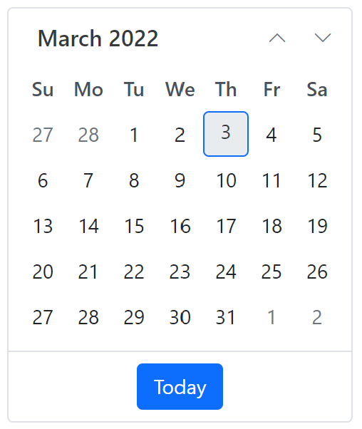

# Getting Started with ASP.NET Core in Visual Studio Code using Razor pages

This article provides a step-by-step instruction for building ASP.NET Core web application using the [Visual Studio Code](https://code.visualstudio.com/) and ASP.NET Core tag helper.

## Prerequisites

[System requirements for ASP.NET Core components](https://ej2.syncfusion.com/aspnetcore/documentation/system-requirements/)

## Create an ASP.NET Core web application

1. Create a new folder and open it in the VS Code by **File > Open Folder...**.
> Visual Studio Code displays a dialog box that asks `Do you trust the authors of the files in this folder`. Select:
* The checkbox trust the authors of all files in the parent folder.
* Yes, I trust the authors.
2. Open the [Integrated Terminal](https://code.visualstudio.com/docs/editor/integrated-terminal) by selecting a menu using **View > Terminal** in VS Code.
3. Run the following command in the terminal to create a new ASP.NET Core web application. 



dotnet new webapp -o AspNetCoreWebApp



The `dotnet new` command creates new Razor Pages project in the AspNetCoreWebApp folder. Please refer to this [topic](https://docs.microsoft.com/en-us/dotnet/core/tools/dotnet-new?tabs=net60) for more information about .NET CLI commands.
4. Run the following command in the terminal to open the project in current instance of the VS Code. 



code -r AspNetCoreWebApp




## Install Syncfusion ASP.NET Core package in the application

Run the following command in the terminal to install `Syncfusion.EJ2.AspNet.Core` NuGet package in the application.



dotnet add package Syncfusion.EJ2.AspNet.Core



Refer to [NuGet packages topic](../nuget-packages/) for more details about NuGet packages.

## Add Syncfusion ASP.NET Core Tag Helper 

Open `~/Views/_ViewImports.cshtml` file and import the `Syncfusion.EJ2` package.



@addTagHelper *, Syncfusion.EJ2



## Add style sheet

Checkout the [Themes topic](../appearance/theme/) to learn different ways ([CDN](../common/adding-script-references), [NPM package](../common/adding-script-references#node-package-manager-npm), and [CRG](../common/custom-resource-generator/)) to refer styles in ASP.NET Core application, and to have the expected appearance for Syncfusion ASP.NET Core controls. Here, the theme is referred using CDN inside the `<head>` of `~/Pages/Shared/_Layout.cshtml` file as follows,



<head>
    ...
    <!-- Syncfusion ASP.NET Core controls style -->
    <link rel="stylesheet" href="https://cdn.syncfusion.com/ej2/{{ site.ej2version }}/material.css" />
</head>



## Add script reference
In this getting started walk-through, the required scripts are referred using [CDN](../common/adding-script-references) inside the `<head>` of `~/Pages/Shared/_Layout.cshtml` file as follows,



<head>
    ...
    <!-- Syncfusion ASP.NET Core controls script -->
    
</head>



## Register Syncfusion Script Manager
Open `~/Pages/Shared/_Layout.cshtml` page and register the script manager <ejs-script> at the end of `<body>` in the ASP.NET Core application as follows. 



<body>
    ...
    <!-- Syncfusion ASP.NET Core Script Manager -->
    <ejs-scripts></ejs-scripts>
</body>



## Add ASP.NET Core Calendar control

Now, add the Syncfusion ASP.NET Core Calendar tag helper in `~/Pages/Index.cshtml` page.




    <ejs-calendar id="calendar"></ejs-calendar>




Press <kbd>Ctrl</kbd>+<kbd>F5</kbd> to run the app. Set `Select Environment` to `.NET Core`, if settings required for VS Code. Then, the default web browser launched with Syncfusion ASP.NET Core Calendar control.

## See also

* [Getting Started with Syncfusion ASP.NET Core using Razor Pages](https://ej2.syncfusion.com/aspnetcore/documentation/getting-started/razor-pages/)
* [Getting Started with Syncfusion ASP.NET Core MVC using Tag Helper](https://ej2.syncfusion.com/aspnetcore/documentation/getting-started/aspnet-core-mvc-taghelper)