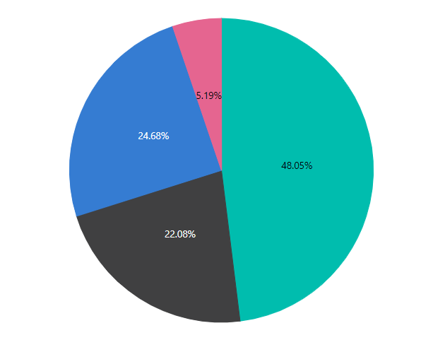

# Data label

Data label can be added to a chart series by enabling the [`Visible`](https://help.syncfusion.com/cr/aspnetcore-js2/Syncfusion.EJ2.Charts.AccumulationDataLabelSettings.html#Syncfusion_EJ2_Charts_AccumulationDataLabelSettings_Visible) option in the dataLabel property.
























## Positioning

Accumulation chart provides support for placing the data label either `Inside` or `Outside` the chart.
























## Smart labels

Datalabels will be arranged smartly without overlapping with each other. You can enable or disable this feature using the [`EnableSmartLabels`](https://help.syncfusion.com/cr/aspnetcore-js2/Syncfusion.EJ2.Charts.AccumulationChart.html#Syncfusion_EJ2_Charts_AccumulationChart_EnableSmartLabels) property.
























## Data Label Template

Label content can be formatted by using the template option. Inside the template, you can add the placeholder text `${point.x}` and `${point.y}` to display corresponding data points x & y value. Using [`Template`](https://help.syncfusion.com/cr/aspnetcore-js2/Syncfusion.EJ2.Charts.AccumulationDataLabelSettings.html#Syncfusion_EJ2_Charts_AccumulationDataLabelSettings_Template) property, you can set data label template in chart.
























## Connector Line

Connector line will be visible when the data label is placed `Outside` the chart. The connector line can be customized using the `Type`, `Color`, `Width`, `Length` and `DashArray` properties.
























## Text Mapping

Text from the data source can be mapped to data label using `Name` property.
























## Customization

Individual text can be customized using the `TextRender` event.
























## Show percentages in data labels of pie chart

You can show the percentages in data labels of pie chart using `textRender` event and `template` option.

### Using textRender event

You can customize the data label of pie chart using [TextRender](https://help.syncfusion.com/cr/aspnetmvc-js2/Syncfusion.EJ2.Charts.AccumulationChart.html#Syncfusion_EJ2_Charts_AccumulationChart_TextRender) event as follows to show percentage.










### Using template

You can display the percentage values in data label of pie chart using `template` option.










