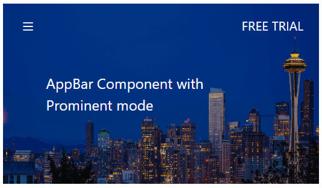

# Size and Color with ##Platform_Name## AppBar Control

## Size

This section briefly explains the different types of AppBar. The available types of the AppBar are as follows:

* Regular AppBar
* Prominent AppBar
* Dense AppBar

### Regular AppBar

This mode is the default one in which the AppBar is displayed with the default height.
























### Prominent AppBar

This height mode can be set to the AppBar by setting `Prominent` to the mode property. The prominent AppBar is displayed with a longer height and can be used for larger titles, images, or texts. It is also longer than the regular AppBar. In the following example, we have customized the prominent text using align-self and white-space CSS properties. You can change the prominent AppBar height if larger titles, images, or texts are used.
























### Dense AppBar

This height mode can be set to the AppBar by setting `Dense` to the mode property. Dense AppBar is displayed with shorter height which is denser to accommodate all the AppBar content.
























## Color

This section briefly explains the different types of background colors used for the AppBar. The background and font colors can be set using the color mode property. The available types of background color for the AppBar are as follows:

* Light AppBar
* Dark AppBar
* Primary AppBar
* Inherit AppBar

### Light AppBar

This color mode is the default one in which the AppBar can be displayed with a light background and its corresponding font color.
























### Dark AppBar

This color mode can be set to the AppBar by setting `Dark` to the property color mode. A dark AppBar can be displayed with a dark background and its corresponding font color.
























### Primary AppBar

This color mode can be set to the AppBar by setting `Primary` to the property color mode. The primary AppBar can be displayed with primary colors.
























### Inherit AppBar

This color mode can be set to the AppBar by setting `Inherit` to the property color mode. The AppBar inherits the background and font color from its parent element.
























