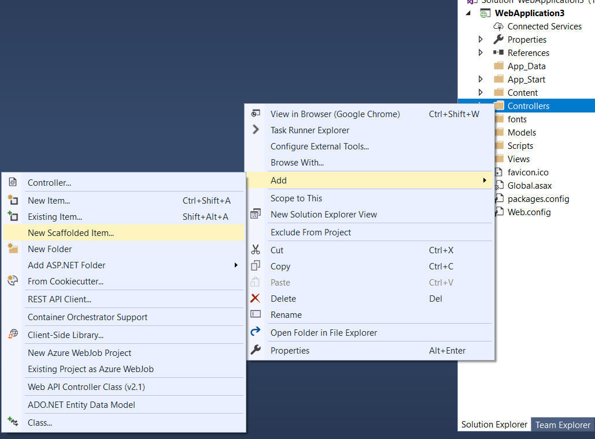
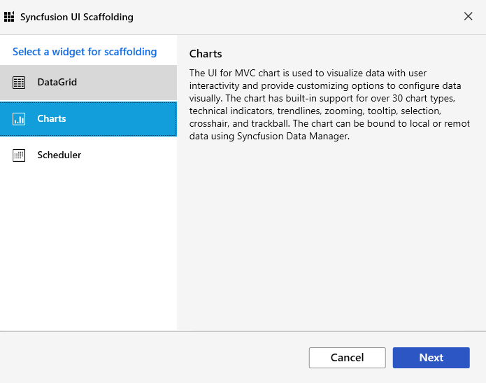
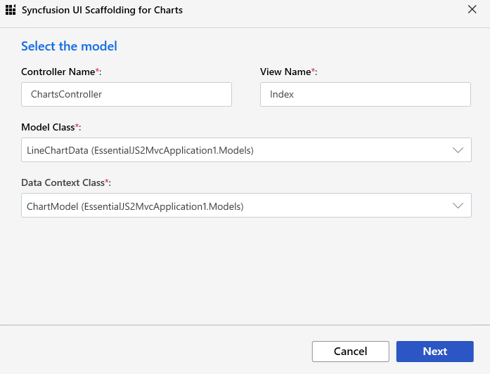
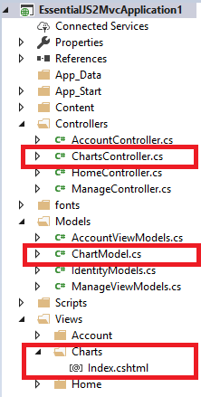

# ASP.NET MVC Scaffolding

Syncfusion includes an extension for **Visual Studio Scaffolding** for the Syncfusion ASP.NET MVC platform to quickly add code that interacts with data models and reduce the amount of time to develop with data operation in your project. Scaffolding provides an easier way to create Views and Controller action methods for Syncfusion ASP.NET MVC  Chart controls.

> The Syncfusion ASP.NET MVC UI Scaffolder is available from **v16.4.0.40**.

## Getting Started

Let's start with the steps on how to scaffold the ASP.NET MVC Chart into your web application.

* Create an ASP.NET MVC application and add an Entity Framework data model referring from the [documentation](https://docs.microsoft.com/en-us/aspnet/mvc/overview/getting-started/database-first-development/creating-the-web-application#generate-the-models) with Scheduler related fields such as Id, Subject, Location, Start Date, End Date and All-day. Once the model file is added, ensure the required DBContext and all its related properties are added.

* Refer the [Getting Started documentation](https://ej2.syncfusion.com/aspnetmvc/documentation/getting-started/visual-studio-2017/#configure-essential-js-2-in-the-application) to know about how to configure the Syncfusion Essential JS2 for ASP.NET MVC in your web application.

## Add a Scaffolded Item

The following steps direct you to add a Scaffolded item to your ASP.NET MVC Web Application.

* Right-click on Controller folder in the Solution Explorer and select **Add → New Scaffolded Item.**

* You will see the Add Scaffold dialog. Select **Syncfusion ASP.NET MVC UI Scaffolder** and click ‘Add’ button, which will display the Syncfusion UI Scaffolding dialog.

* Select the Chart control to perform Scaffolding and click**Next**.

* Syncfusion UI Scaffolding for the selected control dialog will be opened. Enter the **Controller and View** names as per the application requirement. Also, select the required **Model Class** of the active project and its relevant **Data Context Class** and then Click **Next**.

* Syncfusion UI Scaffolding for the Chart control feature dialog will be opened. Select the required features and Click **Add**. Use the **back arrow** if you want to modify the already provided Controller or View name, and to change the **selected Model Class and Data Context Class**.

select the corresponding Chart **X-axis and Y-axis** from option.

* The **Controller** and the corresponding **View** files are now generated with the selected features code snippet.

> Ensure that  at least one Entity Framework model  exists in your project and the application gets compiled once. If no Entity Framework model exists in your application, refer to the [`documentation`](https://docs.microsoft.com/en-us/aspnet/mvc/overview/getting-started/database-first-development/creating-the-web-application#generate-the-models) to generate the Entity Framework model. Once model file added, ensure required DBContext and properties are added. Now, build the application and try scaffolding. If any changes done in model properties later, compile the application once before perform scaffolding.

## How to render Syncfusion Control'?'

Refer to the following UG links to render Syncfusion control after performed scaffolding.

**MVC4:** [`Configure Essential JS 2 using Syncfusion.EJ2.MVC4 package`](https://ej2.syncfusion.com/aspnetmvc/documentation/getting-started/visual-studio-2017/#configure-essential-js-2-in-the-application-1)

**MVC5:** [`Configure Essential JS 2 using Syncfusion.EJ2.MVC5 package`](https://ej2.syncfusion.com/aspnetmvc/documentation/getting-started/visual-studio-2017/#configure-essential-js-2-in-the-application)
