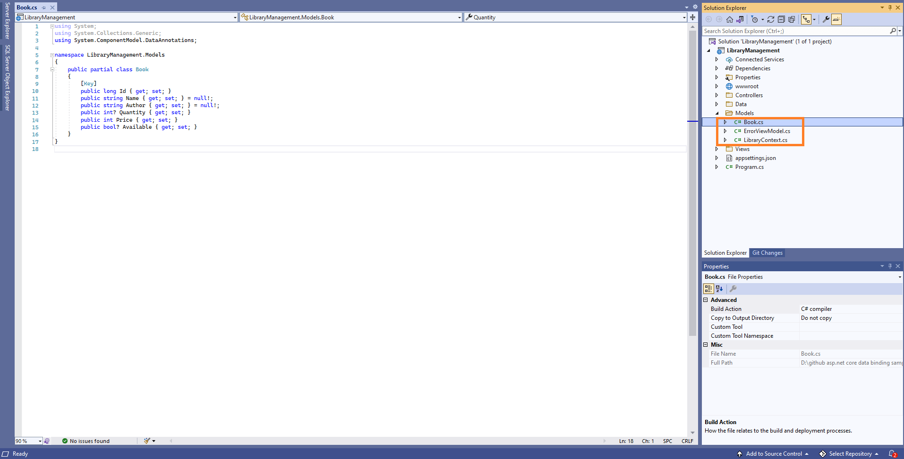
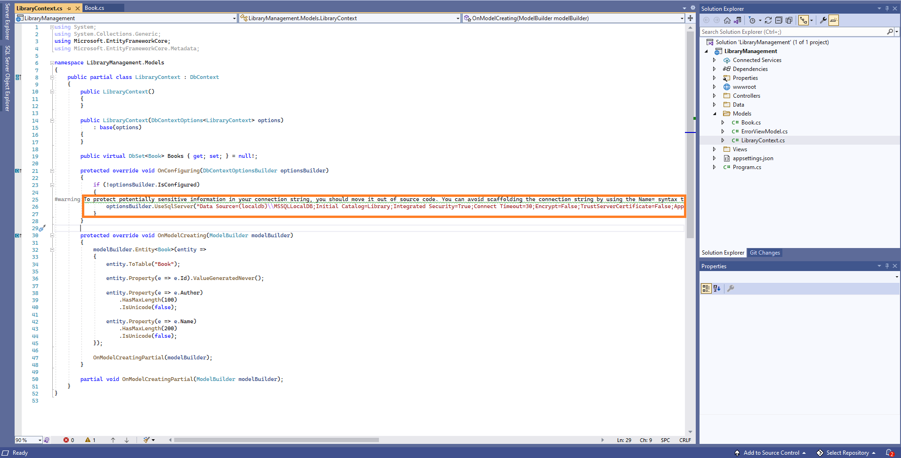
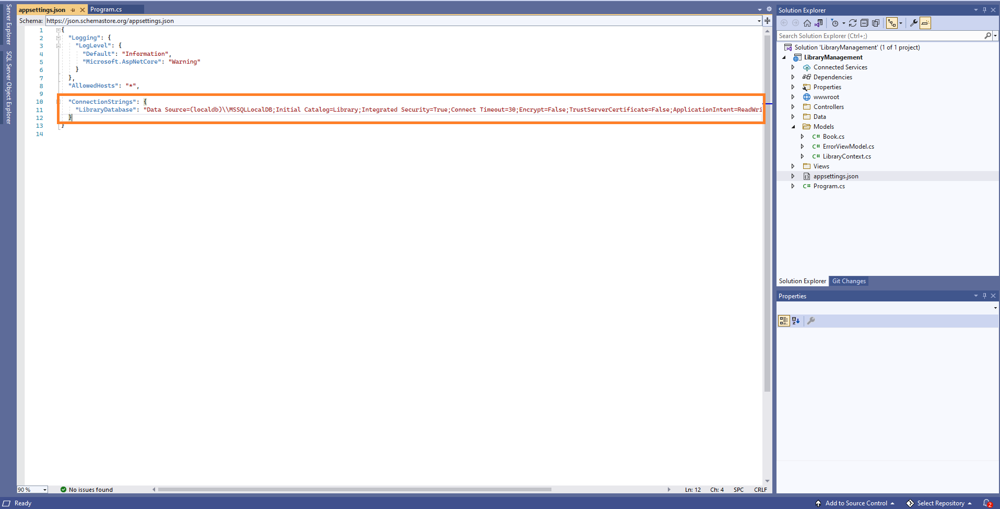

# Bind data from SQL server to ASP.NET Core controls

In this topic, we are going to learn how to retrieve data from SQL database using [Entity Framework](https://docs.microsoft.com/en-us/ef/core/) to bind it to the Grid control and perform CRUD operations. 
Entity Framework is an open-source object-relational mapper (O/RM) from Microsoft.  Entity Framework works with many databases. But here, we are going to discuss the step-by-step procedure to create an Entity Framework using the [MS SQL Server](https://en.wikipedia.org/wiki/Microsoft_SQL_Server) database and connect it to the Syncfusion control to perform CRUD operations in a ASP.NET Core Application.

## Prerequisite software

The following software are needed
* Visual Studio 2022 v17.0 or later.
* .NET SDK 6.0 or later.

## Create the database

The first step is to create a Library database and a table named Book to hold a list of books.

* Open SQL Server Object Explorer.
* Now, create a new database named Library.
* Right-click on the created database and select New Query.
* Use the following SQL query to create a table named Book.




Create Table Book(
Id BigInt Identity(1,1) Primary Key Not Null,
Name Varchar(200) Not Null,
Author Varchar(100) Not Null,
Quantity int,
Price int Not Null,
Available bit)




Now, the Book table design will look like below.


## Create ASP.NET Core MVC Application

Open Visual Studio and follow the steps in the below documentation to create the Application.

[Getting Started](https://ej2.syncfusion.com/aspnetcore/documentation/getting-started/visual-studio-2017/)

## Creating DbContext and model class

Now, we are going to scaffold DbContext and model classes from the existing Library database. To perform scaffolding and work with the SQL Server database in our application, we need to install the following NuGet packages.

Run the following commands in the Package Manager Console.

* **Install-Package Microsoft.EntityFrameworkCore.Tools -Version 6.0.2**: This package creates database context and model classes from the database.
* **Install-Package Microsoft.EntityFrameworkCore.SqlServer -Version 6.0.2**: The database provider that allows Entity Framework Core to work with SQL Server.

Once the above packages are installed, we can scaffold DbContext and Model classes. Run the following command in the Package Manager Console under the LibraryManagement project.




Scaffold-DbContext “Data Source=(localdb)\MSSQLLocalDB;Initial Catalog=Library;Integrated Security=True;Connect Timeout=30;Encrypt=False;TrustServerCertificate=False;ApplicationIntent=ReadWrite;MultiSubnetFailover=False” Microsoft.EntityFrameworkCore.SqlServer -OutputDir Models




The above scaffolding command contains the following details for creating DbContext and model classes for the existing database and its tables.

* **Connection string**: Data Source=(localdb)\MSSQLLocalDB;Initial Catalog=Library;Integrated Security=True;Connect Timeout=30;Encrypt=False;TrustServerCertificate=False;ApplicationIntent=ReadWrite;MultiSubnetFailover=False
* **Data provider**: Microsoft.EntityFrameworkCore.SqlServer
* **Output directory**: -OutputDir Models

After running the above command, **LibraryContext.cs** and **Book.cs** files will be created under the **LibraryManagement.Models** folder as follows.



We can see that **LibraryContext.cs** file contains the connection string details in the OnConfiguring method.



It is not recommended to have a connection string with sensitive information in the **LibraryContext.cs** file, so we are moving the connection string to the **app settings.json** file.



Now, the **DbContext** must be configured using connection string and registered as scoped service using the **AddDbContext** method in **Program.cs**.


## Creating a Data Access Layer in controller

The application is now configured to connect with the **Library** database using Entity Framework. Now, it’s time to consume data from the Library database. To do so, we need to modify the Home controller to serve data from the DbContext to the ASP.NET Core application.

Now, replace the Home controller with the following code which contains code to handle CRUD operations in the Book table.




using LibraryManagement.Models;
using Microsoft.AspNetCore.Mvc;
using System.Diagnostics;
using Syncfusion.EJ2.Base;

namespace LibraryManagement.Controllers
{
    public class HomeController : Controller
    {
        private readonly LibraryContext _context;

        public HomeController(LibraryContext context)
        {
            _context = context;
        }

        public IActionResult Index()
        {
            return View();
        }

        public IActionResult Privacy()
        {
            return View();
        }

        [ResponseCache(Duration = 0, Location = ResponseCacheLocation.None, NoStore = true)]
        public IActionResult Error()
        {
            return View(new ErrorViewModel { RequestId = Activity.Current?.Id ?? HttpContext.TraceIdentifier });
        }

        public IActionResult UrlDatasource([FromBody] DataManagerRequest dm)
        {
            IEnumerable<Book> DataSource = _context.Books.ToList();
            int count = DataSource.Cast<Book>().Count();
            return Json(new { result = DataSource, count = count });
        }


        public ActionResult Insert([FromBody] ICRUDModel<Book> value)
        {
            _context.Books.Add(value.value);
            _context.SaveChanges();
            return Json(value);
        }

        public IActionResult Update([FromBody] ICRUDModel<Book> value)
        {
            var ord = value;
            Book val = _context.Books.Where(or => or.Id == ord.value.Id).FirstOrDefault();
            val.Id = ord.value.Id;
            val.Name = ord.value.Name;
            val.Author = ord.value.Author;
            val.Quantity = ord.value.Quantity;
            val.Price = ord.value.Price;
            val.Available = ord.value.Available;
            _context.SaveChanges();
            return Json(value);
        }

        public IActionResult Delete([FromBody] ICRUDModel<Book> value)
        {
            Book order = _context.Books.Where(c => c.Id == (int)value.key).FirstOrDefault();
            _context.Books.Remove(order);
            _context.SaveChanges();
            return Json(order);
        }

        public class ICRUDModel<T> where T : class
        {
            public int? key { get; set; }
            public T value { get; set; }
        }

    }
}




## Install ASP.NET Core package in the application

Syncfusion ASP.NET Core controls are available in [nuget.org.](https://www.nuget.org/packages?q=syncfusion.EJ2) Refer to [NuGet packages topic](https://ej2.syncfusion.com/aspnetcore/documentation/nuget-packages/) to learn more about installing NuGet packages in various OS environments. To add ASP.NET Core controls in the application, open the NuGet package manager in Visual Studio (Tools → NuGet Package Manager → Manage NuGet Packages for Solution), search for [Syncfusion.EJ2.AspNet.Core](https://www.nuget.org/packages/Syncfusion.EJ2.AspNet.Core/) and then install it.

> The Syncfusion.EJ2.AspNet.Core NuGet package has dependencies, [Newtonsoft.Json](https://www.nuget.org/packages/Newtonsoft.Json/) for JSON serialization and [Syncfusion.Licensing](https://www.nuget.org/packages/Syncfusion.Licensing/) for validating Syncfusion license key.

## Add Syncfusion ASP.NET Core Tag Helper
Open `~/Views/_ViewImports.cshtml` file and import the `Syncfusion.EJ2` TagHelper.




@addTagHelper *, Syncfusion.EJ2



    
## Add Style Sheet

Checkout the [Themes topic](https://ej2.syncfusion.com/aspnetcore/documentation/appearance/theme/) to learn different ways (CDN, NPM package, and [CRG](https://ej2.syncfusion.com/aspnetcore/documentation/common/custom-resource-generator/)) to refer styles in ASP.NET Core application, and to have the expected appearance for Syncfusion ASP.NET Core controls. Here, the theme is referred using CDN inside the `<head>` of `~/Views/Shared/_Layout.cshtml` file as follows,



    <head>
        ....
        ....
        <!-- Syncfusion Essential JS 2 Styles -->
        <link rel="stylesheet" href="https://cdn.syncfusion.com/ej2/{{ site.ej2version }}/material.css" />
    </head>



## Add Script Reference
In this getting started walk-through, the required scripts are referred using CDN inside the `<head>` of `~/Views/Shared/_Layout.cshtml` file as follows,



    <head>
        ....
        ....
        <!-- Syncfusion Essential JS 2 Scripts -->
        <script src="https://cdn.syncfusion.com/ej2/{{ site.ej2version }}/dist/ej2.min.js"></script>
    </head>



## Register Syncfusion Script Manager
Open `~/Views/Shared/_Layout.cshtml` page and register the script manager <ejs-script> at the end of `<body>` in the ASP.NET Core application as follows. 



    <body>
        ....
        ....
        <!-- Syncfusion Script Manager -->
        <ejs-scripts></ejs-scripts>
    </body>



## Add Syncfusion DataGrid control to an application

In previous steps, we have successfully configured the Syncfusion ASP.NET Core package in the application. Now, we can add the grid control to to your **Index.cshtml** view page which is present under `Views/Home` folder.




<ejs-grid id="Grid">
</ejs-grid>




## Binding data to Grid control using Entity Framework

To consume data from the Home Controller, we need to add the **DataManager** with **UrlAdaptor**.




<ejs-grid id="Grid">
<e-data-manager url="/Home/UrlDataSource" adaptor="UrlAdaptor" insertUrl="/Home/Insert" removeUrl="/Home/Delete" updateUrl="/Home/Update" crossDomain="true"></e-data-manager>
</ejs-grid>




Grid columns can be defined by using the [GridColumn](https://help.syncfusion.com/cr/aspnetcore-js2/Syncfusion.EJ2.Grids.GridColumn.html) component. We are going to create columns using the following code.




<ejs-grid id="Grid" toolbar="@(new List<string>() { "Add", "Edit", "Delete", "Cancel", "Update" })">
        <e-data-manager url="/Home/UrlDataSource" adaptor="UrlAdaptor" insertUrl="/Home/Insert" removeUrl="/Home/Delete" updateUrl="/Home/Update" crossDomain="true"></e-data-manager>
        <e-grid-editSettings allowDeleting="true" allowEditing="true" allowAdding="true"></e-grid-editSettings>
        <e-grid-columns>
        <e-grid-column field="Id" headerText="Order ID" type="number" visible="false" textAlign="Right" width="120" isPrimaryKey="true"></e-grid-column>
        <e-grid-column field="Name" headerText="Name" type="string" width="140"></e-grid-column>
        <e-grid-column field="Author" headerText="Author" type="string" textAlign="Right" width="120"></e-grid-column>
        <e-grid-column field="Quantity" headerText="Quantity"  type="number" textAlign="Right" width="140"></e-grid-column>
        <e-grid-column field="Price" headerText="Price"  type="number" textAlign="Right" format="C2" width="120"></e-grid-column>
        <e-grid-column field="Available" headerText="Available" editType="booleanedit" displayAsCheckBox="true" type="boolean" textAlign="Right" width="140"></e-grid-column>
    </e-grid-columns>
 </ejs-grid>




When you run the application, the **UrlDatasource** method will be called in your controller to load the datasource.




using LibraryManagement.Models;
using Microsoft.AspNetCore.Mvc;
using System.Diagnostics;
using Syncfusion.EJ2.Base;
namespace LibraryManagement.Controllers
{
    public class HomeController : Controller
    {
        private readonly LibraryContext _context;

        public HomeController(LibraryContext context)
        {
            _context = context;
        }
        public IActionResult UrlDatasource([FromBody] DataManagerRequest dm)
        {
            IEnumerable<Book> DataSource = _context.Books.ToList();
            int count = DataSource.Cast<Book>().Count();
            return Json(new { result = DataSource, count = count });
        }
        ...
    }
}




The response object from the Web API should contain the properties, `Items` and `Count`, whose values are a collection of entities and the total count of the entities, respectively.

The sample response object should look like this:

```c#

{
    "Items": [{..}, {..}, {..}, ...],
    "Count": 830
}

```

## Handling CRUD operations with ASP.NET Core Grid control

We can enable editing in the grid control using the [GridEditSettings](https://help.syncfusion.com/cr/aspnetcore-js2/Syncfusion.EJ2.Grids.GridEditSettings.html) component. Grid provides various modes of editing options such as [Inline/Normal](https://helpej2.syncfusion.com/aspnetcore/documentation/grid/edit#normal), [Dialog](https://helpej2.syncfusion.com/aspnetcore/documentation/grid/edit#dialog), and [Batch](https://helpej2.syncfusion.com/aspnetcore/documentation/grid/edit#batch) editing.

Here, we are using **Inline** edit mode and used Toolbar property to show toolbar items for editing.
We have added the Grid Editing and Toolbar code with previous Grid model.




<ejs-grid id="Grid" actionBegin="actionBegin" actionComplete="actionComplete"  toolbar="@(new List<string>() { "Add", "Edit", "Delete", "Cancel", "Update" })">
        <e-data-manager url="/Home/UrlDataSource" adaptor="UrlAdaptor" insertUrl="/Home/Insert" removeUrl="/Home/Delete" updateUrl="/Home/Update" crossDomain="true"></e-data-manager>
        <e-grid-editSettings allowDeleting="true" allowEditing="true" allowAdding="true"></e-grid-editSettings>
        <e-grid-columns>
        <e-grid-column field="Id" headerText="Order ID" type="number" visible="false" textAlign="Right" width="120" isPrimaryKey="true"></e-grid-column>
        <e-grid-column field="Name" headerText="Name" type="string" width="140"></e-grid-column>
        <e-grid-column field="Author" headerText="Author" type="string" textAlign="Right" width="120"></e-grid-column>
        <e-grid-column field="Quantity" headerText="Quantity"  type="number" textAlign="Right" width="140"></e-grid-column>
        <e-grid-column field="Price" headerText="Price"  type="number" textAlign="Right" format="C2" width="120"></e-grid-column>
        <e-grid-column field="Available" headerText="Available" editType="booleanedit" displayAsCheckBox="true" type="boolean" textAlign="Right" width="140"></e-grid-column>
    </e-grid-columns>
 </ejs-grid>




> Normal editing is the default edit mode for the Grid control. Set the [IsPrimaryKey](https://help.syncfusion.com/cr/aspnetcore-js2/Syncfusion.EJ2.Grids.GridColumn.html#Syncfusion_EJ2_Grids_GridColumn_IsPrimaryKey) property of Column as **true** for a particular column, whose value is a unique value for editing purposes.

### Insert a row

To insert a new row, click the **Add** toolbar button. The new record edit form will look like below.


Clicking the **Update** toolbar button will insert the record in the Book table by calling the following **Insert** method of the insertUrl.




public ActionResult Insert([FromBody] ICRUDModel<Book> value)
{
    _context.Books.Add(value.value);
    _context.SaveChanges();
    return Json(value);
}





### Update a row

To edit a row, select any row and click the **Edit** toolbar button. The edit form will look like below. Edit the Customer Name column.


Clicking the **Update** toolbar button will update the record in the Orders table by calling the following **Update** method of the updateUrl.




public IActionResult Update([FromBody] ICRUDModel<Book> value)
{
    var ord = value;
    Book val = _context.Books.Where(or => or.Id == ord.value.Id).FirstOrDefault();
    val.Id = ord.value.Id;
    val.Name = ord.value.Name;
    val.Author = ord.value.Author;
    val.Quantity = ord.value.Quantity;
    val.Price = ord.value.Price;
    val.Available = ord.value.Available;
    _context.SaveChanges();
    return Json(value);
}




The resultant grid will look like below.


### Delete a row

To delete a row, select any row and click the **Delete** toolbar button. Deleting operation will send a **DELETE** request to the removeUrl with the selected record`s primary key value to remove the corresponding record from the Book table.




public IActionResult Delete([FromBody] ICRUDModel<Book> value)
{
    Book order = _context.Books.Where(c => c.Id == (int)value.key).FirstOrDefault();
    _context.Books.Remove(order);
    _context.SaveChanges();
    return Json(order);
}



