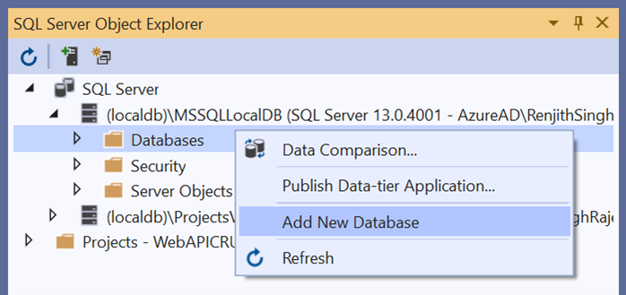
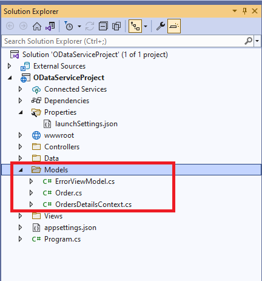

# Bind data from RESTful web services to Syncfusion ASP.NET Core components and perform CRUD operations

In this topic, we are going to learn how to retrieve data from RESTful web services, bind data to a ASP.NET Core Grid component, and perform CRUD operations. Here, we have fetched data from the ODataV4 service using **ODataV4Adaptor** in `DataManger`. It is recommended to choose the suitable adaptor based on the RESTful service which you are using to bind data for the Syncfusion ASP.NET Core component.

## Prerequisite software

The following software are needed
* Visual Studio 2022 v17.0 or later.
* .NET SDK 6.0 or later.

## Create the database

Open Visual Studio 2019 Preview, select **View -> SQL Server Object Explorer**. Right-click on the Databases folder to create a new Database and name it as OrdersDetails.




Right-click on the **Tables** folder of the created database and click **Add New Table**.


Use the following query to add a new table named **Orders**.

```sql
Create Table Orders(
 OrderID BigInt Identity(1,1) Primary Key Not Null,
 CustomerID Varchar(100) Not Null,
 Freight int Null,
 OrderDate datetime null
)
```

Now, the Orders table design will look like below. Click on the **Update** button.


Now, click on **Update Database**.


## Create OData service project

Open Visual Studio and create an empty ASP.NET Core Web Application and name it as ODataServiceProject. After creating the application, install **Microsoft.AspNetCore.OData** package by running the following command in the Package Manager Console.
* **Install-Package Microsoft.AspNetCore.OData -Version 8.0.7**: This package contains everything you need to create OData v4.0 endpoints using ASP.NET Core MVC and to support OData query syntax for your web APIs.

### Generate DbContext and model class from the database

Now, we are going to scaffold **DbContext** and **model classes** from the existing **OrdersDetails** database. To perform scaffolding and work with the SQL Server database in our application, we need to install the following NuGet packages.

Run the following commands in the **Package Manager Console**.

* **Install-Package Microsoft.EntityFrameworkCore.Tools -Version 6.0.2**: This package creates database context and model classes from the database.
* **Install-Package Microsoft.EntityFrameworkCore.SqlServer -Version 6.0.2**: The database provider that allows Entity Framework Core to work with SQL Server.

Once the above packages are installed, we can scaffold DbContext and Model classes. Run the following command in the **Package Manager Console**.

```

Scaffold-DbContext “Data Source=(localdb)\MSSQLLocalDB;Initial Catalog=OrdersDetails;Integrated Security=True;Connect Timeout=30;Encrypt=False;TrustServerCertificate=False;ApplicationIntent=ReadWrite;MultiSubnetFailover=False” Microsoft.EntityFrameworkCore.SqlServer -OutputDir Models

```

The above scaffolding command contains the following details for creating DbContext and model classes for the existing database and its tables.
* **Connection string**: Data Source=(localdb)\MSSQLLocalDB;Initial Catalog=OrdersDetails;Integrated Security=True;Connect Timeout=30;Encrypt=False;TrustServerCertificate=False;ApplicationIntent=ReadWrite;MultiSubnetFailover=False
* **Data provider**: Microsoft.EntityFrameworkCore.SqlServer
* **Output directory**: -OutputDir Models

After running the above command, the **OrdersDetailsContext.cs** and **Orders.cs** files will be created under the **ODataServiceProject.Models** folder as follows.



We can see that OrdersDetailsContext.cs file contains the connection string details in the **OnConfiguring** method.


It is not recommended to have a connection string with sensitive information in the OrdersDetailsContext.cs file, so we are moving the connection string to the **appsettings.json** file.


Now, the DbContext must be configured using connection string and registered as scoped service using the AddDbContext method in **Startup.cs**.


## Add Syncfusion ASP.NET Core grid component to an application

we can add the grid component to the **Index.cshtml** page and retrieve the data using ODataV4Adaptor.

```cshtml

<ejs-grid id="Grid" allowPaging="true" allowsorting="true" allowFiltering="true" toolbar="@(new List<string>() {"Add","Edit","Delete","Update","Cancel" })" load="load">
        <e-grid-columns>
            <e-grid-column field="OrderID" headerText="Order ID" type="number" textAlign="Right" width="120"></e-grid-column>
            <e-grid-column field="CustomerID" headerText="Customer ID" type="string" width="140"></e-grid-column>
            <e-grid-column field="Freight" headerText="Freight" textAlign="Right" format="C2" width="120"></e-grid-column>
            <e-grid-column field="OrderDate" headerText="Order Date" format='yMd' textAlign="Right" width="140"></e-grid-column>
        </e-grid-columns>
    </ejs-grid>

    <script>
        function load() {
            this.dataSource = new ej.data.DataManager({ url: "https://localhost:44364/odata/Orders", adaptor: new ej.data.ODataV4Adaptor({ updateType: 'PUT' }) });
        }
    </script>

```

