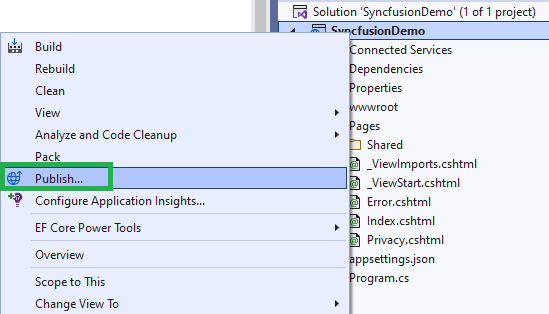
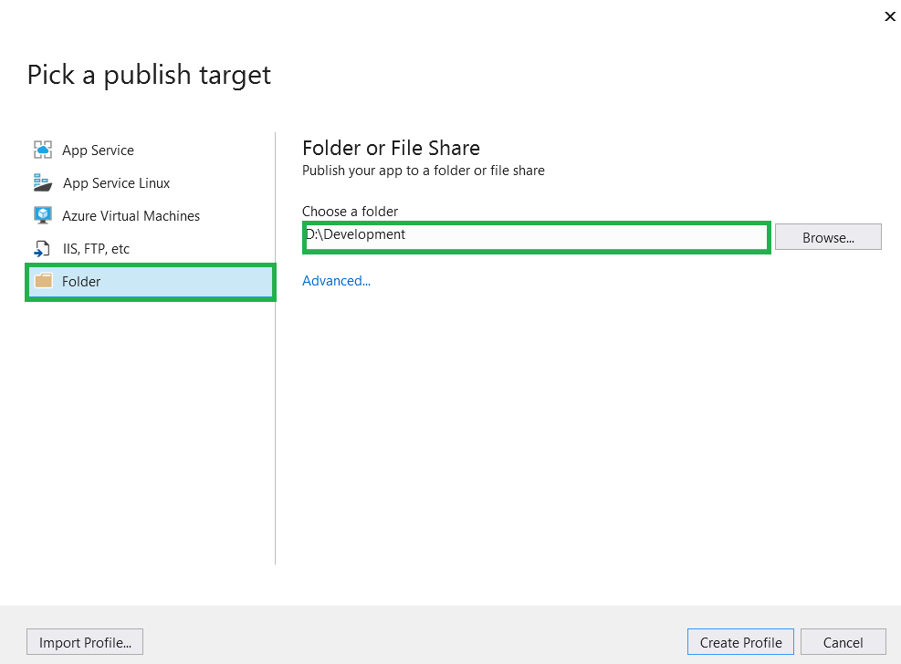
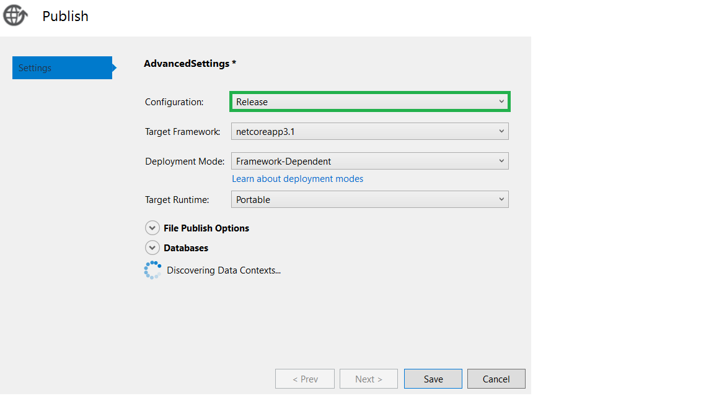

# Deployment in ASP.NET Core

This section provides information about deploying ASP.NET Core applications with the Syncfusion ASP.NET Core components.

Refer to [Host and deploy ASP.NET Core](https://docs.microsoft.com/en-us/aspnet/core/host-and-deploy/?view=aspnetcore-6.0) topic for more information.

## Publish ASP.NET Core Application with Visual Studio

* Right-click on the project in the `Solution Explorer` and select `Publish`.



* Then, select the `Folder` option and select the publishing target location.



* Check the configuration as Release by clicking the `Advanced...` option below the target location.



* For `ASp.NET Core application`, Set Deployment Mode as `Self-Contained`. Because some dependencies are not loaded properly when we host the published folder.


* Then, click `Save` and `Publish`.

    > Refer [here](https://docs.microsoft.com/en-us/visualstudio/deployment/quickstart-deploy-aspnet-web-app?view=vs-2022&tabs=azure) for publishing the application to Azure App Service using Visual Studio.  

## Publish ASP.NET Core Application with CLI

Packing the application and its dependencies into a folder for deployment to a hosting system by using the `dotnet publish` command.

For CLI deployment, run the following command from your root directory.

```
dotnet publish -c Release
```

For ASP.NET Core CLI deployment.

```
dotnet publish -c Release --self-contained true -r win-x86
```

Refer to the dotnet publish\'s [optional arguments](https://docs.microsoft.com/en-us/dotnet/core/tools/dotnet-publish?tabs=netcore21#arguments).

Use the following command to specify the path for the output directory.

```
dotnet publish -c Release -o <output directory>
```

> If the output directory is not specified, it defaults to **./bin/[configuration]/[framework]/publish/** for a **framework-dependent deployment** or **./bin/[configuration]/[framework]/[runtime]/publish/** for a **self-contained deployment**.

If the path is relative, the output directory generated is relative to the project file location, not to the current working directory.

Also, refer to the MSDN reference [here](https://docs.microsoft.com/en-us/aspnet/core/host-and-deploy/azure-apps/?view=aspnetcore-6.0&tabs=netcore-cli#deploy-the-app-self-contained).

Now, you can host the published folder by using the IIS or Azure app service.

## See Also

* [Host and Deploy ASP.NET Core](https://docs.microsoft.com/en-us/aspnet/core/host-and-deploy/?view=aspnetcore-6.0)
* [Publish a Web app to Azure App Service using Visual Studio](https://docs.microsoft.com/en-us/visualstudio/deployment/quickstart-deploy-aspnet-web-app)
* [Publish a Web app to Azure App Service using Visual Studio for Mac](https://docs.microsoft.com/en-us/visualstudio/mac/publish-app-svc?toc=%2Faspnet%2Fcore%2Ftoc.json&bc=%2Faspnet%2Fcore%2Fbreadcrumb%2Ftoc.json&view=vsmac-2019)
* [Deploy ASP.NET Core apps to Azure App Service](https://docs.microsoft.com/en-us/aspnet/core/host-and-deploy/azure-apps/)