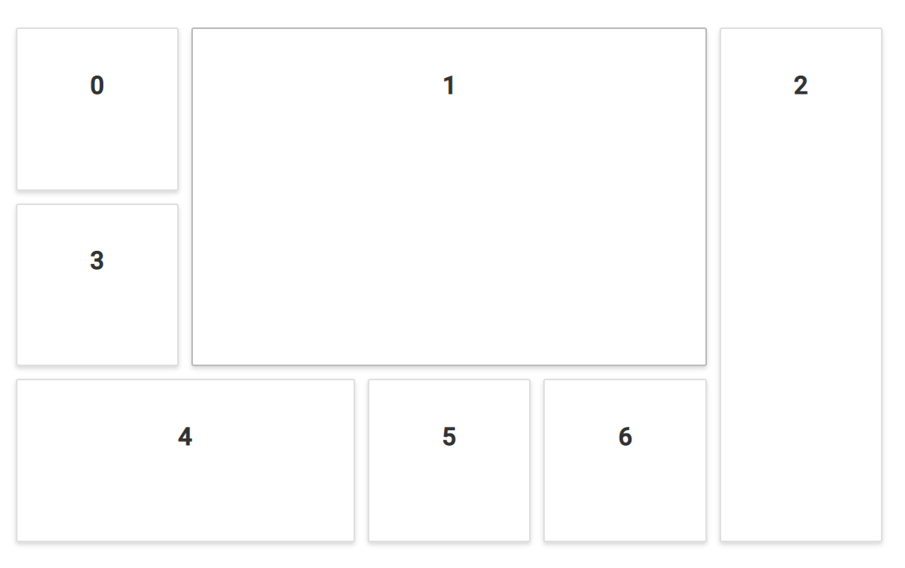

# Dragging of panels

The Dashboard Layout component is provided with dragging functionality to drag and reorder the panels within the layout. While dragging a panel, a holder will be highlighted below the panel indicating the panel placement on panel drop. This helps the user to decide whether to place the panel in the current position or revert to previous position without disturbing the layout.

If one or more panels collide while dragging, then the colliding panels will be pushed towards the left or right or top or bottom direction where an adaptive space for the collided panel is available. The position changes of these collided panels will be updated dynamically during dragging of a panel, so the user can conclude whether to place the panel in the current position or not.

While dragging a panel in Dashboard layout the following dragging events will be triggered,
* [`dragStart`](https://help.syncfusion.com/cr/cref_files/aspnetcore-js2/Syncfusion.EJ2~Syncfusion.EJ2.Layouts.DashboardLayout~DragStart.html) - Triggers when panel drag starts
* [`drag`](https://help.syncfusion.com/cr/cref_files/aspnetcore-js2/Syncfusion.EJ2~Syncfusion.EJ2.Layouts.DashboardLayout~Drag.html) - Triggers when panel is being dragged
* [dragStop](https://help.syncfusion.com/cr/cref_files/aspnetcore-js2/Syncfusion.EJ2~Syncfusion.EJ2.Layouts.DashboardLayout~DragStop.html) - Triggers when panel drag stops

The following sample demonstrates dragging and pushing of panels. For example, while dragging the panel 0 over panel 1, these panels get collided and push the panel 1 towards the feasible direction, so that, the panel 0 gets placed in the panel 1 position.





Output be like the below.

## Customizing the dragging handler

Initially, the complete panel will act as the handler for dragging the panel such that the dragging action occurs on clicking anywhere over a panel. However, this dragging handler for the panels can be customized using the [`draggableHandle`](https://help.syncfusion.com/cr/cref_files/aspnetcore-js2/Syncfusion.EJ2~Syncfusion.EJ2.Layouts.DashboardLayout~DraggableHandle.html) property to restrict the dragging action within a particular element in the panel.

The following sample demonstrates customizing the dragging handler of the panels where the dragging action of panel occurs only with the header of the panel.





Output be like the below.

# Disable dragging of panels

By default, the dragging of panels is enabled in Dashboard Layout. It can also be disabled with the help of [`allowDragging`](https://help.syncfusion.com/cr/cref_files/aspnetcore-js2/Syncfusion.EJ2~Syncfusion.EJ2.Layouts.DashboardLayout~AllowDragging.html) API. Setting [`allowDragging`](https://help.syncfusion.com/cr/cref_files/aspnetcore-js2/Syncfusion.EJ2~Syncfusion.EJ2.Layouts.DashboardLayout~AllowDragging.html) to false disables the dragging functionality in Dashboard Layout.

The following sample demonstrates Dashboard Layout with dragging support disabled.





Output be like the below.

> You can refer to our [ASP.NET Core Dashboard Layout](https://www.syncfusion.com/aspnet-core-ui-controls/dashboard-layout) feature tour page for its groundbreaking feature representations. You can also explore our [ASP.NET Core Dashboard Layout example](https://ej2.syncfusion.com/aspnetcore/DashboardLayout/DefaultFunctionalities#/material) to knows how to present and manipulate data.