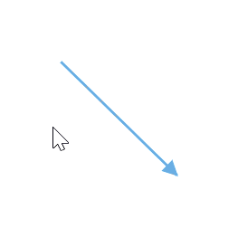

* Each segment of a selected connector is editable with some specific handles/thumbs.

* For connector editing, you have to inject the [`ConnectorEditing`](https://ej2.syncfusion.com/documentation/api/diagram/connectorEditing) module.

# End point handles in connector

Source and target points of the selected connectors are represented with two handles. Clicking and dragging those handles helps to adjust the source and target points.

* If you drag the connector end points, then the following events can be used to do your customization.
* When the connector source point is changed, the [`sourcePointChange`](https://help.syncfusion.com/cr/aspnetcore-js2/Syncfusion.EJ2.Diagrams.Diagram.html#Syncfusion_EJ2_Diagrams_Diagram_SourcePointChange) event gets triggered.
* When the connector target point is changed, the [`targetPointChange`](https://help.syncfusion.com/cr/aspnetcore-js2/Syncfusion.EJ2.Diagrams.Diagram.html#Syncfusion_EJ2_Diagrams_Diagram_TargetPointChange) event gets triggered.
* When you connect connector with ports/node or disconnect from it, the [`connectionChange`](https://help.syncfusion.com/cr/aspnetcore-js2/Syncfusion.EJ2.Diagrams.Diagram.html#Syncfusion_EJ2_Diagrams_Diagram_ConnectionChange) event gets triggered.
