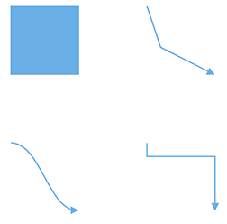

# Selection in diagram

Selector provides a visual representation of selected elements. It behaves like a container and allows to update the size, position, and rotation angle of the selected elements through interaction and by using program. Single or multiple elements can be selected at a time.

## Single selection

An element can be selected by clicking that element. During single click, all previously selected items are cleared.

* While selecting the diagram elements, the following events can be used to do your customization.
* When selecting or unselecting the diagram elements, the [`selectionChange`](https://help.syncfusion.com/cr/aspnetcore-js2/Syncfusion.EJ2.Diagrams.Diagram.html#Syncfusion_EJ2_Diagrams_Diagram_SelectionChange) event gets triggered.

## Selecting a group

When a child element of any group is clicked, its contained group is selected instead of the child element. With consecutive clicks on the selected element, selection is changed from top to bottom in the hierarchy of parent group to its children.

## Multiple selection

Multiple elements can be selected with the following ways:

* Ctrl+Click - During single click, any existing item in the selection list will be cleared, and only the item clicked recently will be there in the selection list. To avoid cleaning the old selected item, Ctrl key must be on hold when clicking.

* Selection rectangle/rubber band selection - Clicking and dragging the diagram area allows to create a rectangular region. The elements that are covered under the rectangular region are selected at the end.

## Select/Unselect elements using program

The client-side methods [`select`](https://help.syncfusion.com/cr/aspnetcore-js2/Syncfusion.EJ2.Diagrams.html) and [`clearSelection`](https://help.syncfusion.com/cr/aspnetcore-js2/Syncfusion.EJ2.Diagrams.html) helps to select or clear the selection of the elements at runtime.

Get the current selected items from the [`nodes`](https://help.syncfusion.com/cr/aspnetcore-js2/Syncfusion.EJ2.Diagrams.DiagramSelector.html#Syncfusion_EJ2_Diagrams_DiagramSelector_Nodes) and [`connectors`](https://help.syncfusion.com/cr/aspnetcore-js2/Syncfusion.EJ2.Diagrams.DiagramSelector.html#Syncfusion_EJ2_Diagrams_DiagramSelector_Connectors) collection of the [`selectedItems`](https://help.syncfusion.com/cr/aspnetcore-js2/Syncfusion.EJ2.Diagrams.Diagram.html#Syncfusion_EJ2_Diagrams_Diagram_SelectedItems) property of the diagram model.

## Select entire elements in diagram programmatically

The client-side method [`selectAll`](https://help.syncfusion.com/cr/aspnetcore-js2/Syncfusion.EJ2.Diagrams.html) is used to select all the elements such as nodes/connectors in the diagram. Refer to the following link which shows how to use [`selectAll`](https://help.syncfusion.com/cr/aspnetcore-js2/Syncfusion.EJ2.Diagrams.html) method on the diagram.