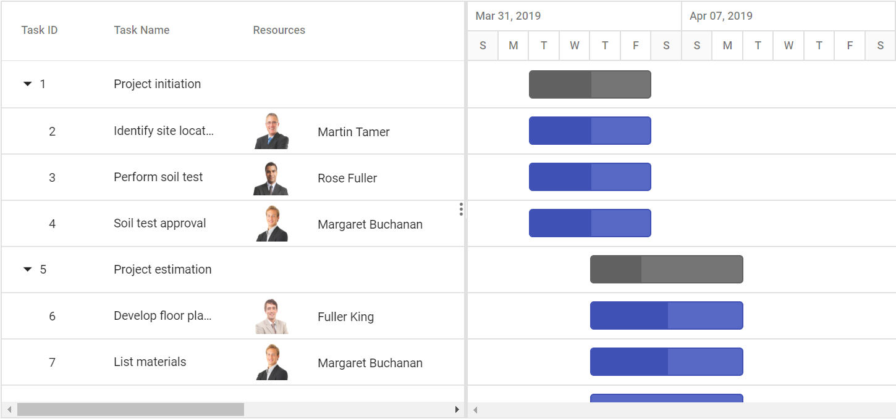
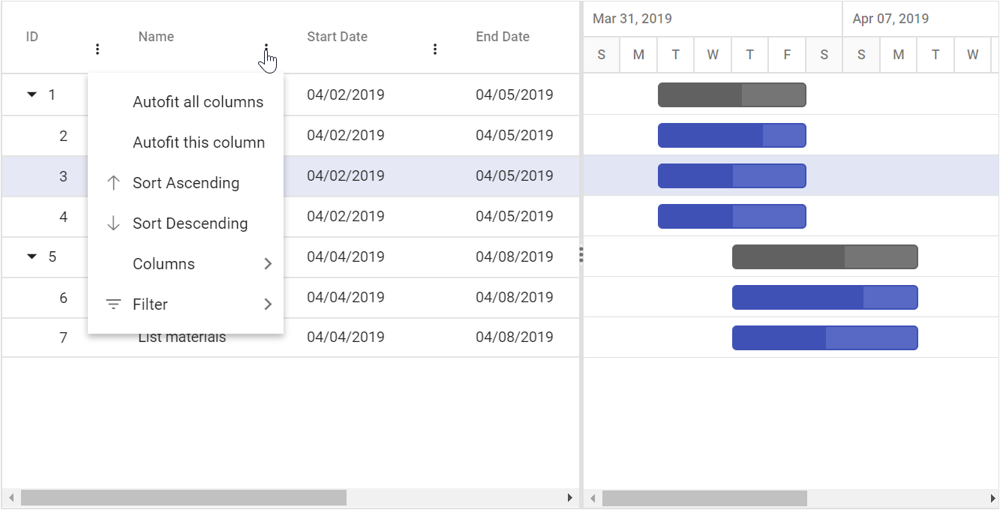
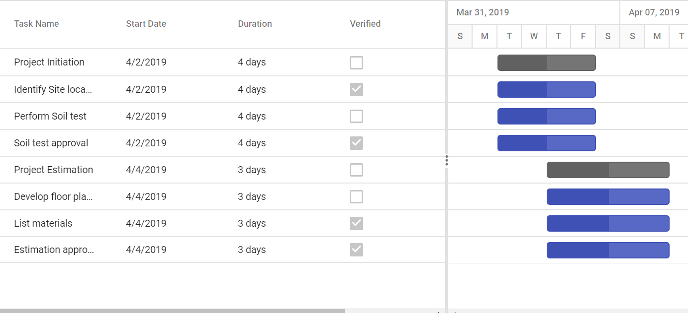
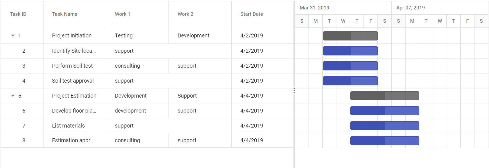

{ type:'date', format:'dd/MM/yyyy' } | 04/07/2019
{ type:'date', format:'dd.MM.yyyy' } | 04.07.2019
{ type:'date', skeleton:'short' } | 7/4/19
{ type: 'dateTime', format: 'dd/MM/yyyy hh:mm a' } | 04/07/2019 12:00 AM
{ type: 'dateTime', format: 'MM/dd/yyyy hh:mm:ss a' } | 07/04/2019 12:00:00 AM





## Column reordering

The column reordering can be done by dragging a column header from one index to another index within the TreeGrid. To enable reordering, set the [`AllowReordering`](https://help.syncfusion.com/cr/aspnetcore-js2/Syncfusion.EJ2.Gantt.Gantt.html#Syncfusion_EJ2_Gantt_Gantt_AllowReordering) property to true.





> You can disable the reordering of a particular column by setting the [`Columns.AllowReordering`](https://help.syncfusion.com/cr/aspnetcore-js2/Syncfusion.EJ2.Gantt.GanttColumn.html#Syncfusion_EJ2_Gantt_GanttColumn_AllowReordering) property to `false`.

### Reorder Events

During the reorder action, the gantt component triggers the below three events.

1. The [`columnDragStart`](https://help.syncfusion.com/cr/aspnetcore-js2/Syncfusion.EJ2.Gantt.Gantt.html#Syncfusion_EJ2_Gantt_Gantt_ColumnDragStart) event triggers when column header element drag (move) starts.
2. The [`columnDrag`](https://help.syncfusion.com/cr/aspnetcore-js2/Syncfusion.EJ2.Gantt.Gantt.html#Syncfusion_EJ2_Gantt_Gantt_ColumnDrag) event triggers when column header element is dragged (moved) continuously.
3. The [`columnDrop`](https://help.syncfusion.com/cr/aspnetcore-js2/Syncfusion.EJ2.Gantt.Gantt.html#Syncfusion_EJ2_Gantt_Gantt_ColumnDrop) event triggers when a column header element is dropped on the target column.





## Reorder multiple columns

Multiple columns can be reordered at a time by using the `reorderColumns` method.





## Column resizing

The column width can be resized by clicking and dragging the right edge of the column header. While dragging, the width of the column will be resized immediately. Each column can be auto resized by double-clicking the right edge of the column header to fit the width of that column based on the widest cell content. To resize the column, set the [`AllowResizing`](https://help.syncfusion.com/cr/aspnetcore-js2/Syncfusion.EJ2.Gantt.Gantt.html#Syncfusion_EJ2_Gantt_Gantt_AllowResizing) property to true. The following code example shows how to enable the column resize feature in the Gantt control.





> You can disable resizing for a particular column by setting the [`Columns.AllowResizing`](https://help.syncfusion.com/cr/aspnetcore-js2/Syncfusion.EJ2.Gantt.GanttColumn.html#Syncfusion_EJ2_Gantt_GanttColumn_AllowResizing) to `false`.

### Defining minimum and maximum column width

The column resizing can be restricted between minimum and maximum widths by defining the [`Columns->MinWidth`](https://help.syncfusion.com/cr/aspnetcore-js2/Syncfusion.EJ2.Gantt.GanttColumn.html#Syncfusion_EJ2_Gantt_GanttColumn_MinWidth) and [`Columns->MaxWidth`](https://help.syncfusion.com/cr/aspnetcore-js2/Syncfusion.EJ2.Gantt.GanttColumn.html#Syncfusion_EJ2_Gantt_GanttColumn_MaxWidth) properties.

In the following example, the minimum and maximum widths are defined for the `Duration`, and `Task Name` columns.





## Column template

A column template is used to customize the column’s look. The following code example explains how to define the custom template in Gantt using the [`Template`](https://help.syncfusion.com/cr/aspnetcore-js2/Syncfusion.EJ2.Gantt.GanttColumn.html#Syncfusion_EJ2_Gantt_GanttColumn_Template) property.





## Column menu

The column menu has options to integrate features like sorting, filtering, and autofit. It will show a menu with the integrated feature when users click the Multiple icon of the column. To enable the column menu, you should set the [`ShowColumnMenu`](https://help.syncfusion.com/cr/aspnetcore-js2/Syncfusion.EJ2.Gantt.Gantt.html#Syncfusion_EJ2_Gantt_Gantt_ShowColumnMenu) property to true.
The default items are displayed in the following table:

| Item | Description |
|-----|-----|
| `SortAscending` | Sort the current column in ascending order. |
| `SortDescending` | Sort the current column in descending order. |
| `AutoFit` | Auto fit the current column. |
| `AutoFitAll` | Auto fit all columns. |
| `Filter` | Show the filter option as given in the `filterSettings.type` property. |





> You can disable the column menu for a particular column by setting the `Columns.ShowColumnMenu` to `false`.

### Column menu Events

During the resizing action, the gantt component triggers the below two events.

1. The [`columnMenuOpen`](https://help.syncfusion.com/cr/aspnetcore-js2/Syncfusion.EJ2.Gantt.Gantt.html#Syncfusion_EJ2_Gantt_Gantt_ColumnMenuOpen) event triggers before the column menu opens.
2. The [`columnMenuClick`](https://help.syncfusion.com/cr/aspnetcore-js2/Syncfusion.EJ2.Gantt.Gantt.html#Syncfusion_EJ2_Gantt_Gantt_ColumnMenuClick) event triggers when the user clicks the column menu of the gantt.





### Custom Column Menu Item

Custom column menu items can be added by defining the `columnMenuItems`.
Actions for this customized items can be defined in the [`columnMenuClick`](https://help.syncfusion.com/cr/aspnetcore-js2/Syncfusion.EJ2.Gantt.Gantt.html#Syncfusion_EJ2_Gantt_Gantt_ColumnMenuClick) event.





### Customize menu items for particular columns

Sometimes, you have a scenario that to hide an item from column menu for particular columns. In that case, you need to define the `columnMenuOpenEventArgs.hide` as true in the [`columnMenuOpen`](https://help.syncfusion.com/cr/aspnetcore-js2/Syncfusion.EJ2.Gantt.Gantt.html#Syncfusion_EJ2_Gantt_Gantt_ColumnMenuOpen) event.

The following sample, **Filter** item was hidden in column menu when opens for the **Task Name** column.





## Responsive columns

You can toggle the column visibility based on media queries, which are defined in the [`HideAtMedia`](https://help.syncfusion.com/cr/aspnetcore-js2/Syncfusion.EJ2.Gantt.GanttColumn.html#Syncfusion_EJ2_Gantt_GanttColumn_HideAtMedia). The [`HideAtMedia`](https://help.syncfusion.com/cr/aspnetcore-js2/Syncfusion.EJ2.Gantt.GanttColumn.html#Syncfusion_EJ2_Gantt_GanttColumn_HideAtMedia) accepts valid [Media Queries]( http://cssmediaqueries.com/what-are-css-media-queries.html ).





## Change tree/expander column

The tree/expander column is a column in the Gantt control, that has icons to expand or collapse the parent records. You can define the tree column index in the Gantt control by using the [`TreeColumnIndex`](https://help.syncfusion.com/cr/aspnetcore-js2/Syncfusion.EJ2.Gantt.Gantt.html#Syncfusion_EJ2_Gantt_Gantt_TreeColumnIndex) property and the default value of this property is `0`. The following code example shows how to use this property.





## Show or Hide columns Dynamically

You can show or hide gantt columns dynamically using external buttons by invoking the `showColumn` or `hideColumn` method. The **Progress** column is hidden and shown on button clicking.





## Checkbox Column

To render boolean values as checkbox in columns, you need to set [`displayAsCheckBox`](../api/gantt/column/#displayascheckbox) property as **true**.





## Controlling Grid actions

You can enable or disable gantt action for a particular column by setting the `allowFiltering`, `allowSorting`, `allowReordering`, and [`allowEditing`](https://help.syncfusion.com/cr/aspnetcore-js2/Syncfusion.EJ2.Gantt.GanttEditSettingsBuilder.html#Syncfusion_EJ2_Gantt_GanttEditSettingsBuilder_AllowEditing_System_Boolean_) properties.





## Column Type

Column type can be specified using the `columns.type` property. It specifies the type of data the column binds.

If the `format` is defined for a column, the column uses `type` to select the appropriate format option **number** or **date**.

Gantt column supports the following types:
* string
* number
* boolean
* date
* date-time
> If the `type` is not defined, it will be determined from the first record of the `dataSource`.
> In case if the first record of the `dataSource` is null/blank value for a column then it is necessary to define the `type` for that column.

## Column Spanning

The gantt has option to span the adjacent cells. You need to define the `colSpan` attribute to span cells in the [`QueryCellInfo`](https://help.syncfusion.com/cr/aspnetcore-js2/Syncfusion.EJ2.Gantt.Gantt.html#Syncfusion_EJ2_Gantt_Gantt_QueryCellInfo) event.

In the following demo, **Work 1** cells have been spanned.





