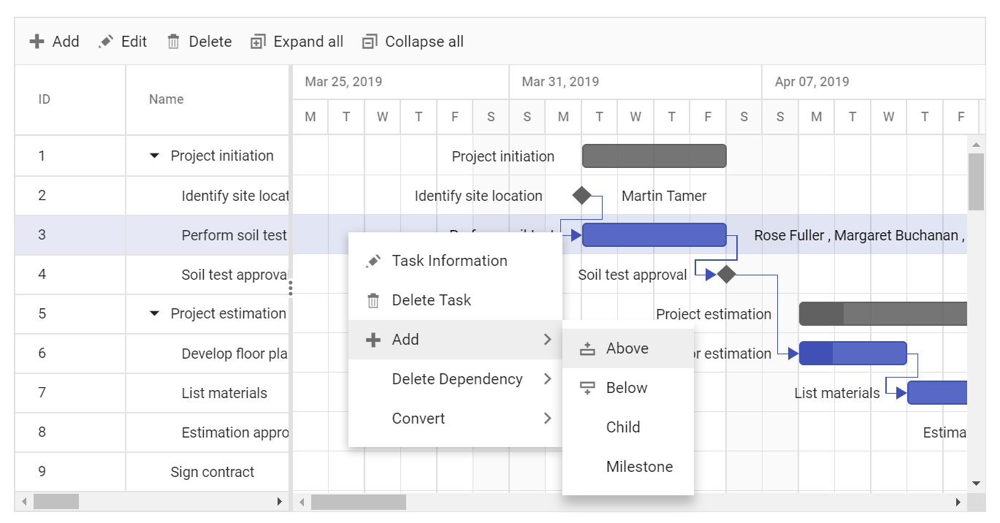
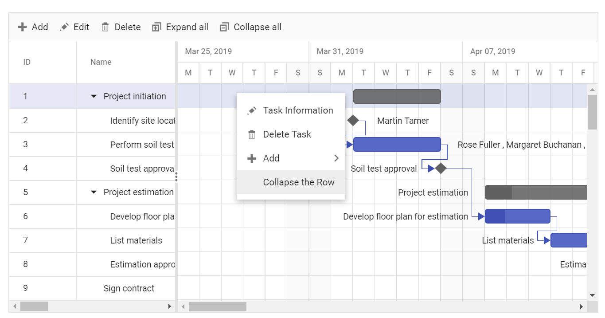

# Context menu

The Gantt control allows to perform quick actions by using context menu. When right-clicking the context menu, the context menu options are shown. To enable this feature, set the `enableContextMenu` to true. The default context menu options are enabled using the `editSettings` property. The context menu options can be customized using the `contextMenuItems` property.

The default items are listed in the following table.

|Items| Description|
|----|----|
|`AutoFit`|  Auto-fits the current column.|
|`AutoFitAll` | Auto-fits all columns.|
|`SortAscending` | Sorts the current column in ascending order.|
|`SortDescending` | Sorts the current column in descending order.|
|`TaskInformation`|  Edits the current task.|
|`Add` | Adds a new row to the Gantt.|
|`Indent` | Indent the selected record to one level.|
|`Outdent` | Outdent the selected record to one level.|
|`DeleteTask` | Deletes the current task.|
|`Save` | Saves the edited task.|
|`Cancel` | Cancels the edited task.|
|`DeleteDependency` | Deletes the current dependency task link.|
|`Convert` | Converts current task to milestone or vice-versa.|
























## Custom context menu items

The custom context menu items can be added by defining the [`contextMenuItems`](https://help.syncfusion.com/cr/aspnetcore-js2/Syncfusion.EJ2.Gantt.Gantt.html#Syncfusion_EJ2_Gantt_Gantt_ContextMenuItems) as a collection of [`contextMenuItemModel`]. Actions for the customized items can be defined in the [`contextMenuClick`](https://help.syncfusion.com/cr/aspnetcore-js2/Syncfusion.EJ2.Gantt.Gantt.html#Syncfusion_EJ2_Gantt_Gantt_ContextMenuClick) event and the visibility of customized items can be defined in the [`contextMenuOpen`] event.

To create custom context menu items for header area, define the target property as `.e-gridheader`.

The following sample shows context menu item for parent rows to expand or collapse child rows in the content area and a context menu item to hide columns in the header area.
























> You can show a specific item in context menu for header/content area in the Gantt control by defining the `target` property.