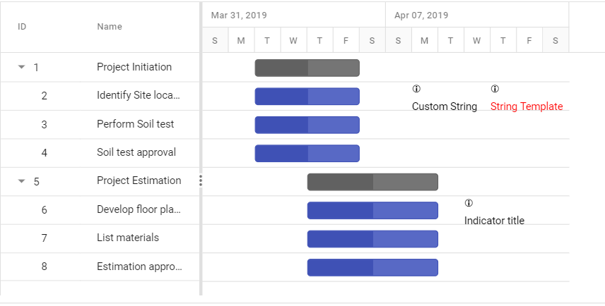

# Data markers

Data markers are a set of events used to represent the schedule events for a task. Data markers are defined in data source as array of objects, and this value is mapped to the Gantt control using the [`taskFields.indicators`](https://help.syncfusion.com/cr/aspnetcore-js2/Syncfusion.EJ2.Gantt.GanttTaskFields.html#Syncfusion_EJ2_Gantt_GanttTaskFields_Indicators) property. You can represent more than one data marker in a task.

Data markers can be defined using the following properties:

* `date`: Defines the date of indicator.
* `iconClass`: Defines the icon class of indicator.
* `name`: Defines the name of indicator.
* `tooltip`: Defines the tooltip of indicator.

> Data Marker `tooltip` will be rendered only if tooltip property has value.
























