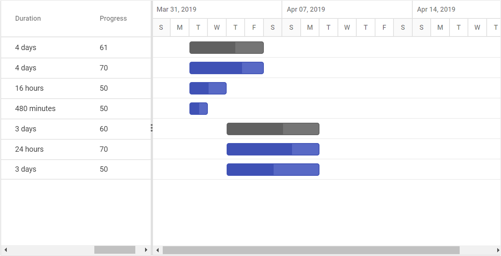

# Scheduling Tasks

## Duration units

In Gantt, the task's duration value can be measured by the following duration units,

* Day
* Hour
* Minute

In Gantt, we can define duration unit for whole project by using [`durationUnit`](https://help.syncfusion.com/cr/aspnetcore-js2/Syncfusion.EJ2.Gantt.Gantt.html#Syncfusion_EJ2_Gantt_Gantt_DurationUnit) property, when we defines the value for this property, this unit will be applied for all task which don't has duration unit value.
And each task in the project can be defined with different duration units and the duration unit of a task can be defined by the following ways,

* Using [`taskFields.durationUnit`](https://help.syncfusion.com/cr/aspnetcore-js2/Syncfusion.EJ2.Gantt.GanttTaskFieldsBuilder.html#Syncfusion_EJ2_Gantt_GanttTaskFieldsBuilder_DurationUnit_System_String_) property, to map the duration unit data source field.
* Defining the duration unit value along with the duration field in the data source.

### Mapping the duration unit field

The below code snippet explains the mapping of duration unit data source field to the Gantt control using the [`taskFields.durationUnit`](https://help.syncfusion.com/cr/aspnetcore-js2/Syncfusion.EJ2.Gantt.GanttTaskFieldsBuilder.html#Syncfusion_EJ2_Gantt_GanttTaskFieldsBuilder_DurationUnit_System_String_) property.
























> NOTE
The default value of the [`durationUnit`](https://help.syncfusion.com/cr/aspnetcore-js2/Syncfusion.EJ2.Gantt.GanttTaskFieldsBuilder.html#Syncfusion_EJ2_Gantt_GanttTaskFieldsBuilder_DurationUnit_System_String_) property is `day`.

### Defining duration unit along with duration field

Duration units for the tasks can also be defined along with the duration values, the below code snippet explains the duration unit for a task along with duration value,
























>
The edit type of the duration column in Gantt is string, to support editing the duration field along with duration units.