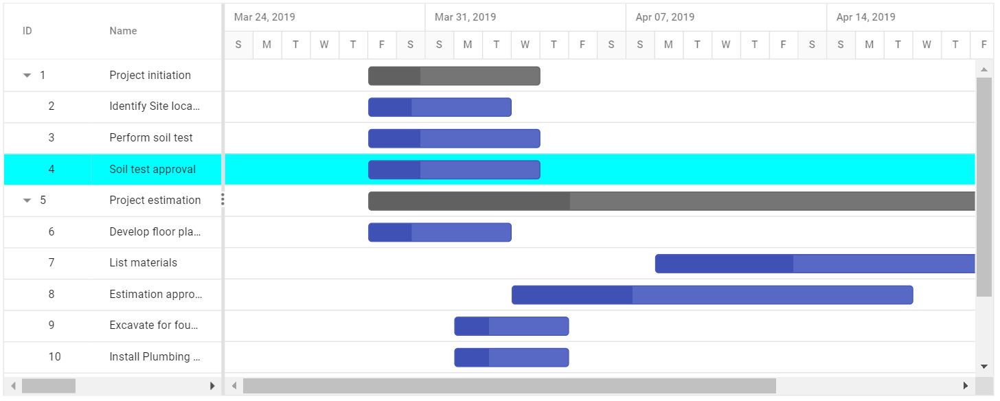
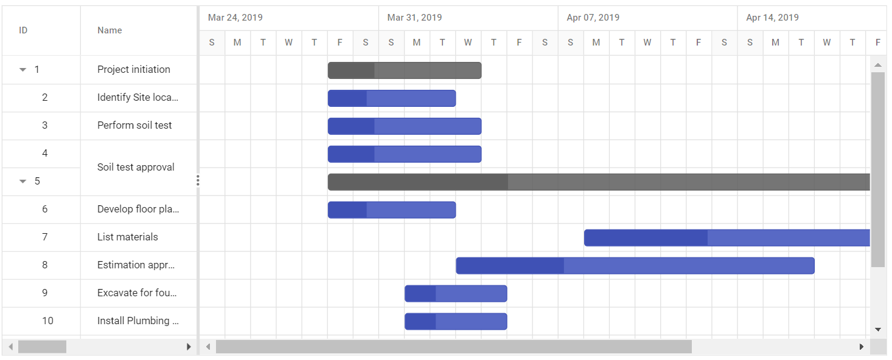

`RowDragStartHelper`  |Triggers when clicking the drag icon or Gantt row.
`RowDragStart`  |Triggers when drag action starts in Gantt.
`RowDrag`  |Triggers while dragging the Gantt row.
`RowDrop`  |Triggers when a drag row was dropped on the target row.

### Customize row drag and drop action

In Gantt, the `RowDragStartHelper` and `RowDrop` events are triggered on row drag and drop action. Using this event, you can prevent dragging of particular record, validate the drop position, and cancel the drop action based on the target record and dragged record. The following topics explains about this.

#### Prevent dragging of particular record

You can prevent drag action of the particular record by setting the `cancel` property to `true`, which is available in the `RowDragStartHelper` event argument based on our requirement. In the following sample, drag action was restricted for first parent record and its child records.





#### Validating drop position

You can prevent drop action based on the drop position and target record, by this, you can prevent dropping particular task on a specific task or specific position. This can be achieved by setting the `cancel` property to `true`, which is available in the `RowDrop` event argument.

In the following sample, we have prevented the drop action based on the position. In this sample, you cannot drop row as child in any of the available rows.





### Perform row drag and drop action programmatically

Gantt provides option to perform row drag and drop action programmatically by using the `reorderRows` method, this method can be used for any external actions like button click.
The following arguments are used to specify the positions to drag and drop a row:

* `fromIndexes`: Index value of source(dragging) row.
* `toIndex`: Value of target index.
* `position`: Drop positions such as above, below, or child.

The following code example shows how to drag and drop a row on button click action.





## Customize rows

You can customize the appearance of a row in grid side, by using the [`rowDataBound`](../api/gantt/#rowdatabound) event and in chart side by using [`queryTaskbarInfo`](../api/gantt/#querytaskbarinfo) event







## Styling alternate rows

 You can change the background colour of alternative rows in Gantt chart, by overriding the class as shown below.

```css
.e-altrow, tr.e-chart-row:nth-child(even)  {
    background-color: #f2f2f2;
}
```






## Row spanning

Gantt chart has an option to span row cells. You can achieve this using [`rowSpan`](../api/gantt/queryCellInfoEventArgs/#rowspan) attribute to span cells in the [`QueryCellInfo`](../api/gantt/queryCellInfoEventArgs) event.

In the following demo, **Soil test approval** cell is spanned to two rows in the **TaskName** column.





