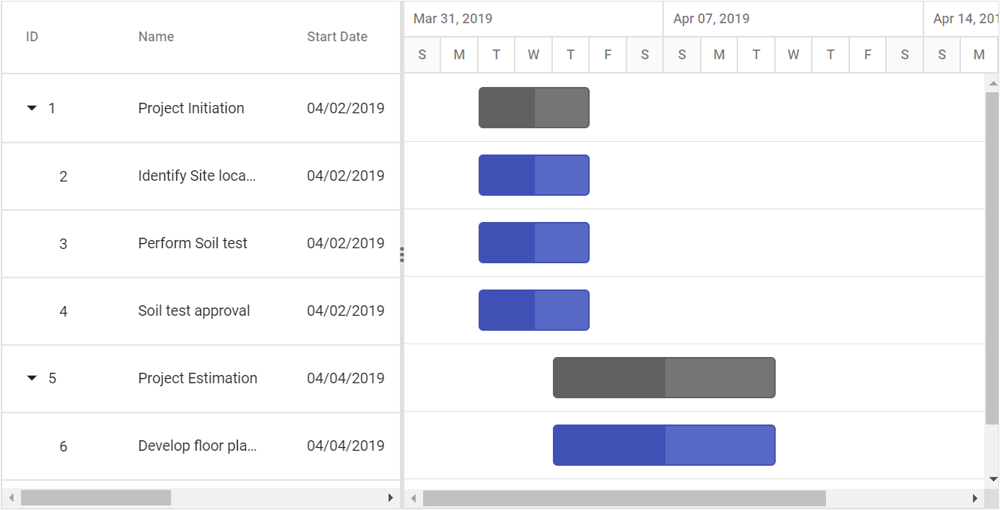
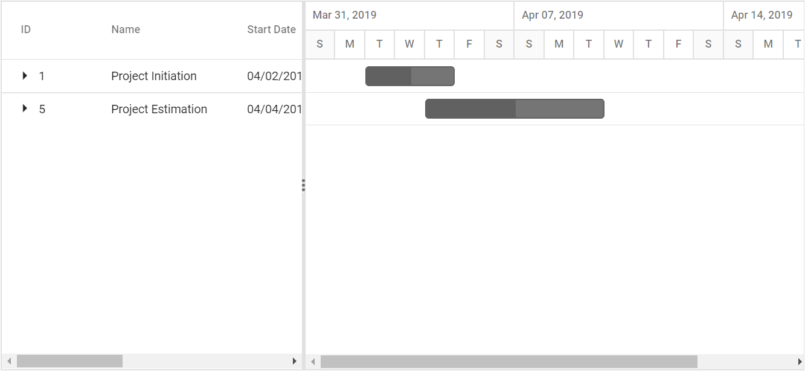
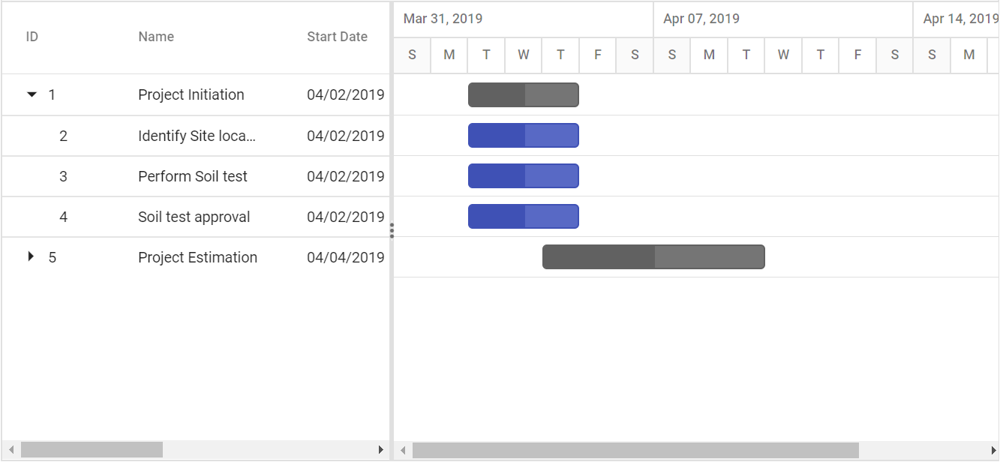
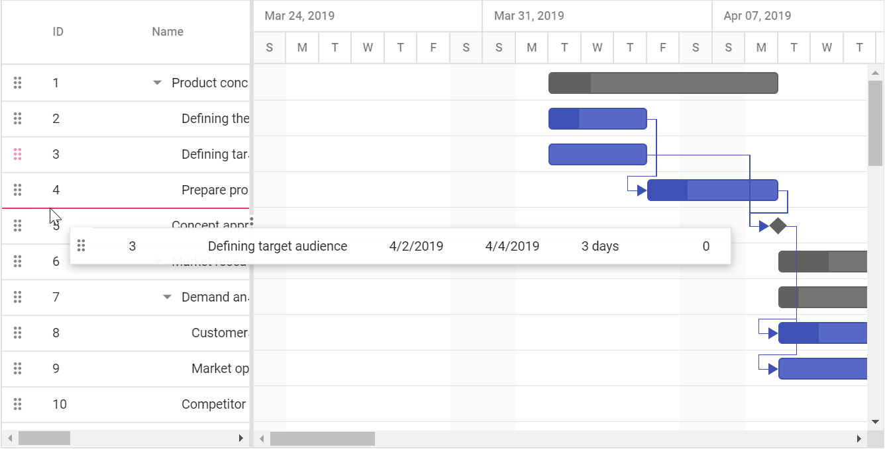
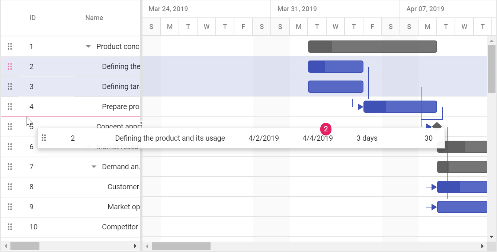
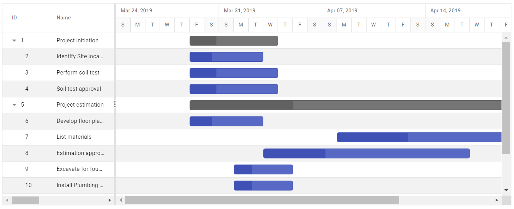

# Rows

Row represents a task information from the data source, and it is possible to perform the following actions in Gantt rows.

## Row height

It is possible to change the height of the row in Gantt by setting row height in pixels to the [`RowHeight`](https://help.syncfusion.com/cr/cref_files/aspnetcore-js2/Syncfusion.EJ2~Syncfusion.EJ2.Gantt.Gantt~RowHeight.html) property. The following code example explains how to change the row height in Gantt at load time.



























## Expand/Collapse Row

In Gantt parent tasks are expanded/collapsed by using expand/collapse icons, expand all/collapse all toolbar items and by using public methods. By default all tasks in Gantt was rendered in expanded state but we can change this status in Gantt.

### Collapse all tasks at Gantt load

All tasks available in Gantt was rendered in collapsed state by setting [`CollapseAllParentTasks`](https://help.syncfusion.com/cr/cref_files/aspnetcore-js2/Syncfusion.EJ2~Syncfusion.EJ2.Gantt.Gantt~CollapseAllParentTasks.html) property as `true`. The following code example shows how to use this property.



























### Define expand/collapse status of tasks

In Gantt, we can render some tasks in collapsed state and some tasks in expanded state, this can done by defining expand status of the task in data source. This value was mapped to Gantt control by using [`ExpandState`](https://help.syncfusion.com/cr/cref_files/aspnetcore-js2/Syncfusion.EJ2~Syncfusion.EJ2.Gantt.GanttTaskFields~ExpandState.html) property. The following code example shows how to use this property.



























### Customize expand/collapse action

On expand action [`Expanding`](https://help.syncfusion.com/cr/cref_files/aspnetcore-js2/Syncfusion.EJ2~Syncfusion.EJ2.Gantt.Gantt~Expanding.html) and [`Expanded`](https://help.syncfusion.com/cr/cref_files/aspnetcore-js2/Syncfusion.EJ2~Syncfusion.EJ2.Gantt.Gantt~Expanded.html) event will be triggered with current expanding row’s information. Similarly on collapse action [`Collapsing`](https://help.syncfusion.com/cr/cref_files/aspnetcore-js2/Syncfusion.EJ2~Syncfusion.EJ2.Gantt.Gantt~Collapsing.html) and [`Collapsed`](https://help.syncfusion.com/cr/cref_files/aspnetcore-js2/Syncfusion.EJ2~Syncfusion.EJ2.Gantt.Gantt~Collapsed.html) event will be triggered. Using this events and it’s arguments we can customize the expand/collapse action. The following code example shows how to prevent the particular row from expand/collapse action using [`Expanding`](https://help.syncfusion.com/cr/cref_files/aspnetcore-js2/Syncfusion.EJ2~Syncfusion.EJ2.Gantt.Gantt~Expanding.html) and [`Collapsing`](https://help.syncfusion.com/cr/cref_files/aspnetcore-js2/Syncfusion.EJ2~Syncfusion.EJ2.Gantt.Gantt~Collapsing.html) event.

























## Drag and drop

You can dynamically rearrange the rows in the Gantt control by using the `AllowRowDragAndDrop` property. Using this property, row drag and drop can be enabled or disabled in Gantt. Using this feature, rows can be dropped at above and below as a sibling or child to the existing rows.



























### Multiple row drag and drop

Gantt also supports dragging multiple rows at a time and drop them on any rows above, below, or at child positions. In Gantt, you can enable the multiple drag and drop by setting the `SelectionSettings.Type` to `Multiple` and you should enable the `AllowRowDragAndDrop` property.



























### Drag and drop events

We provide various events to customize the row drag and drop action, the following table explains about the available events and its details.

|Event Name |Description|
|-----|-----|
|`RowDragStartHelper`  |Triggers when clicking the drag icon or Gantt row.|
|`RowDragStart`  |Triggers when drag action starts in Gantt.|
|`RowDrag`  |Triggers while dragging the Gantt row.|
|`RowDrop`  |Triggers when a drag row was dropped on the target row.|

### Customize row drag and drop action

In Gantt, the `RowDragStartHelper` and `RowDrop` events are triggered on row drag and drop action. Using this event, you can prevent dragging of particular record, validate the drop position, and cancel the drop action based on the target record and dragged record. The following topics explains about this.

#### Prevent dragging of particular record

You can prevent drag action of the particular record by setting the `cancel` property to `true`, which is available in the `RowDragStartHelper` event argument based on our requirement. In the following sample, drag action was restricted for first parent record and its child records.

























#### Validating drop position

You can prevent drop action based on the drop position and target record, by this, you can prevent dropping particular task on a specific task or specific position. This can be achieved by setting the `cancel` property to `true`, which is available in the `RowDrop` event argument.

In the following sample, we have prevented the drop action based on the position. In this sample, you cannot drop row as child in any of the available rows.
























### Prevent reordering a row as child to another row

You can prevent the default behavior of dropping rows as children to the target by setting the `cancel` property to `true` in [rowDrop](https://help.syncfusion.com/cr/aspnetcore-js2/Syncfusion.EJ2.TreeGrid.TreeGrid.html#Syncfusion_EJ2_TreeGrid_TreeGrid_RowDrop) event argument. You can also change the drop position after cancelling using `reorderRows` method.

In the below example drop action is cancelled and dropped above to target row.
























### Perform row drag and drop action programmatically

Gantt provides option to perform row drag and drop action programmatically by using the `reorderRows` method, this method can be used for any external actions like button click. The following arguments are used to specify the positions to drag and drop a row:

* `fromIndexes`: Index value of source(dragging) row.
* `toIndex`: Value of target index.
* `position`: Drop positions such as above, below, or child.

The following code example shows how to drag and drop a row on button click action.

























## Customize rows

You can customize the appearance of a row in grid side, by using the [`rowDataBound`](../api/gantt/#rowdatabound) event and in chart side by using [`queryTaskbarInfo`](../api/gantt/#querytaskbarinfo) event.

























## Styling alternate rows

You can change the background colour of alternative rows in Gantt chart, by overriding the class as shown below.

```css
.e-altrow, tr.e-chart-row:nth-child(even)  {
    background-color: #f2f2f2;
}
```



























## Row spanning

Gantt chart has an option to span row cells. You can achieve this using [`rowSpan`](../api/gantt/queryCellInfoEventArgs/#rowspan) attribute to span cells in the [`QueryCellInfo`](../api/gantt/queryCellInfoEventArgs) event.

In the following demo, **Soil test approval** cell is spanned to two rows in the **TaskName** column.

























