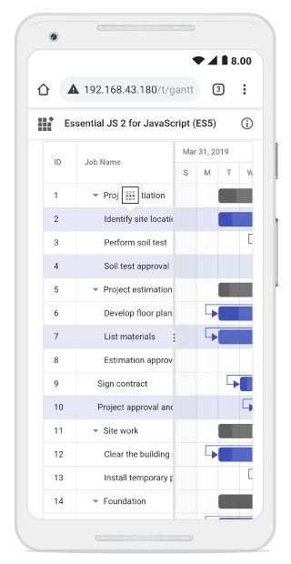

`Parent taskbar` | You cannot create dependency relationship to parent tasks.   
`Taskbar without dependency` |  If you tap a valid child taskbar, it will create `FS` type dependency line between tasks, otherwise exits from task dependency edit mode.   
`Taskbar with dependency` | If you tap the second taskbar, which has already been directly connected, it will ask to remove it.   
`Removing dependency` | Once you tap the taskbar with direct dependency, then confirmation dialog will be shown for removing dependency.   

> Note: In mobile device, you cannot create dependency other than `FS` by taskbar editing. By using cell/dialog editing, you can add all type of dependencies.

## Selection

When you `tap` gantt row, tapped row will be selected.

[`Single selection`](selection/#selection-mode) : To select a single row or cell, perform `single tap` on it.

[`Multiple selection`](selection/#multiple-row-selection) : To perform multiple selection, `tap` on the multiple selection popup, and then tap the desired rows or cells.

