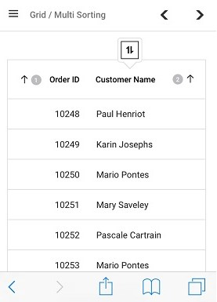

# Sorting

Sorting enables you to sort data in the `Ascending` or `Descending` order.
To sort a column, click the column header.

To enable sorting in the Grid, set the [`AllowSorting`](https://help.syncfusion.com/cr/aspnetcore-js2/Syncfusion.EJ2.Grids.GridBuilder-1.html#Syncfusion_EJ2_Grids_GridBuilder_1_AllowSorting_System_Boolean_) to true. Sorting options can be configured through the [`SortSettings`](https://help.syncfusion.com/cr/aspnetcore-js2/Syncfusion.EJ2.Grids.GridBuilder-1.html#Syncfusion_EJ2_Grids_GridBuilder_1_SortSettings_Syncfusion_EJ2_Grids_GridSortSettings_).





> * Grid columns are sorted in the `Ascending` order. If you click the already sorted column, the sort direction toggles.
> * You can apply and clear sorting by invoking `sortColumn` and `clearSorting` methods.
> * To disable sorting for a particular column, set the [`Columns.AllowSorting`](https://help.syncfusion.com/cr/aspnetcore-js2/Syncfusion.EJ2.Grids.GridColumn.html#Syncfusion_EJ2_Grids_GridColumn_AllowSorting) to false.

## Initial sort

To sort at initial rendering, set the `Field` and
`Direction` in the [`SortSettings.Columns`](https://help.syncfusion.com/cr/aspnetcore-js2/Syncfusion.EJ2.Grids.GridSortSettings.html).





## Multi-column sorting

You can sort more than one column in a Grid. To sort multiple columns, press and hold the `CTRL` key and click the column header. The sorting order will be displayed in the header while performing multi-column sorting.

To clear sorting for a particular column, press the "Shift + mouse left click".

> The [`AllowSorting`](https://help.syncfusion.com/cr/aspnetcore-js2/Syncfusion.EJ2.Grids.GridBuilder-1.html#Syncfusion_EJ2_Grids_GridBuilder_1_AllowSorting_System_Boolean_) must be `true` while enabling multi-column sort.
> Set [`AllowMultiSorting`](https://help.syncfusion.com/cr/aspnetcore-js2/Syncfusion.EJ2.Grids.GridBuilder-1.html#Syncfusion_EJ2_Grids_GridBuilder_1_AllowMultiSorting_System_Boolean_) property as `false` to disable multi-column sorting.





## Sort order

By default, the sorting order will be as `ascending -> descending -> none`.

When first click a column header it sorts the column in ascending. Again click the same column header, it will sort the column in descending. A repetitive third click on the same column header will clear the sorting.

## Sort foreign key column based on Text

For local data in Grid, sorting will be performed based on the [`Column.ForeignKeyValue`](https://help.syncfusion.com/cr/aspnetcore-js2/Syncfusion.EJ2.Grids.GridColumn.html#Syncfusion_EJ2_Grids_GridColumn_ForeignKeyValue).

For remote data in Grid, sorting will be performed based on the [`Column.ForeignKeyField`](https://help.syncfusion.com/cr/aspnetcore-js2/Syncfusion.EJ2.Grids.GridColumn.html#Syncfusion_EJ2_Grids_GridColumn_ForeignKeyField) instead of [`Column.ForeignKeyValue`](https://help.syncfusion.com/cr/aspnetcore-js2/Syncfusion.EJ2.Grids.GridColumn.html#Syncfusion_EJ2_Grids_GridColumn_ForeignKeyValue). To sort a column based on the displayed text and not based on the [`Column.ForeignKeyField`](https://help.syncfusion.com/cr/aspnetcore-js2/Syncfusion.EJ2.Grids.GridColumn.html#Syncfusion_EJ2_Grids_GridColumn_ForeignKeyField), we need to handle the sorting operation at the server side.

The following code example describes the handling of sorting operation at the server side.





## Sorting events

During the sort action, the grid component triggers two events. The [`ActionBegin`](https://help.syncfusion.com/cr/aspnetcore-js2/Syncfusion.EJ2.Grids.GridBuilder-1.html#Syncfusion_EJ2_Grids_GridBuilder_1_ActionBegin_System_String_) event triggers before the sort action starts, and the [`ActionComplete`](https://help.syncfusion.com/cr/aspnetcore-js2/Syncfusion.EJ2.Grids.GridBuilder-1.html#Syncfusion_EJ2_Grids_GridBuilder_1_ActionComplete_System_String_) event triggers after the sort action is completed. Using these events you can perform the needed actions.





> The `args.requestType` is the current action name. For example, in sorting the `args.requestType` is 'sorting'.

## Touch interaction

When you tap the grid header on touchscreen devices, the selected column header is sorted. A popup  is displayed for multi-column sorting. To sort multiple columns, tap the popup, and then tap the desired grid headers.

> The [`AllowMultiSorting`](https://help.syncfusion.com/cr/aspnetcore-js2/Syncfusion.EJ2.Grids.GridBuilder-1.html#Syncfusion_EJ2_Grids_GridBuilder_1_AllowMultiSorting_System_Boolean_) and [`AllowSorting`](https://help.syncfusion.com/cr/aspnetcore-js2/Syncfusion.EJ2.Grids.GridBuilder-1.html#Syncfusion_EJ2_Grids_GridBuilder_1_AllowSorting_System_Boolean_) should be `true` then only the popup will be shown.

The following screenshot shows grid touch sorting.

