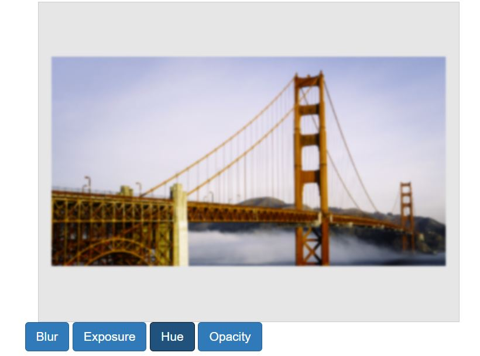

# Finetune in Image editor control

Fine-tuning involves making precise adjustments to the settings of an image filter in order to achieve a specific desired effect. It provides control over the intensity and specific aspects of the filter's impact on the image. For example, fine-tuning allows you to modify parameters like brightness, saturation, or other relevant properties to fine-tune the level or quality of the filter's effect. This level of control enables you to achieve the exact look or outcome you want for your image. 

The `finetuneImage` method which takes two parameters: the filter, and the value that adjusts the color of the image. The filter parameter specifies the type of filter as ImageFinetuneOption, such as brightness, saturation, or blur and the value parameter specifies the amount or intensity of the filter to be applied to an image. 

## Adjust the brightness, contrast, or sharpness 

The `finetuneImage` method is used to perform brightness, contrast, or sharpness finetuning by specifying this type as a first parameter and specifying the finetuning value as the second parameter of the method. 

Here is an example of brightness, contrast, and sharpness finetuning using the `finetuneImage` method.
























Output be like the below.

## Adjust the hue, exposure, blur, or opacity 

The `finetuneImage` method is used to perform hue, exposure, or blur finetuning by specifying this type as a first parameter and specifying the finetuning value as the second parameter of the method. 

Here is an example of hue, exposure, and blur finetuning using the `finetuneImage` method.
























Output be like the below.

## Finetune value changing event 

The `finetuneValueChanging` event is triggered when performing finetuning on the image. This event is passed an object that contains information about the finetuning event, such as the type of fine-tuning and the value of fine-tuning performed. 

The parameter available in the `finetuneValueChanging` event is, 

FinetuneEventArgs.finetune - The type of finetuning as ImageFinetuneOption to be applied in the image editor. 

FinetuneEventArgs.value - The finetuning value to be applied in the image editor. 

FinetuneEventArgs.cancel – Specifies a boolean value to cancel the finetuning action. 