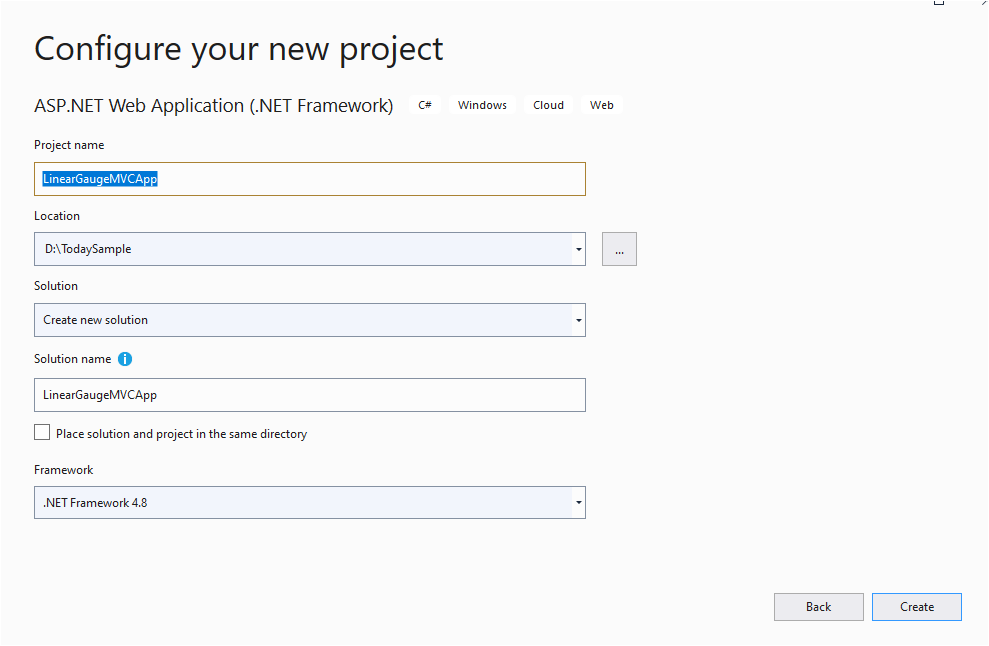
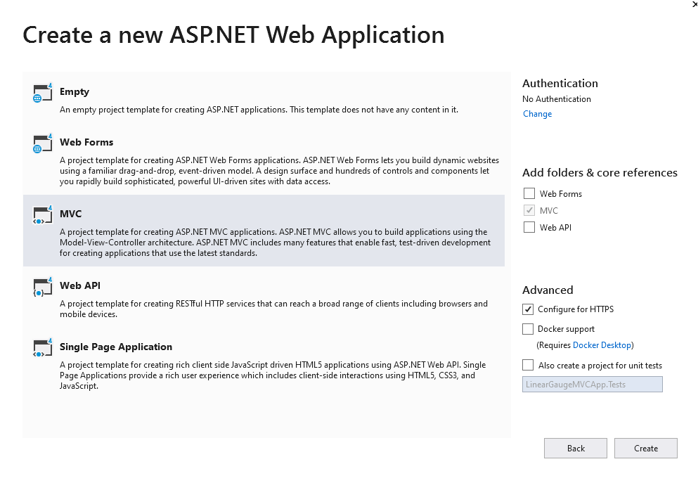
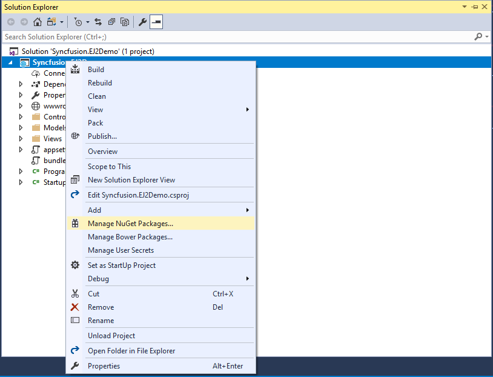

# Getting Started with ASP.NET MVC Linear Gauge

## Prerequisites

To get start with ASP.NET MVC application, ensure the following software are installed on the machine.

1. .Net Framework 4.5 and above.
2. ASP.NET MVC 4 or ASP.NET MVC 5
3. Visual Studio

## Preparing ASP.NET MVC application

The following steps are used to create ASP.NET MVC Application.

**Step 1:** Open the Visual Studio and click the **File** menu and select **New -> Project** option.


**Step 2:** Select **ASP.NET Web Application  (.NET Framework)** templates in visual studio 2019 and click **Next**.


**Step 3:** Change the application name and location of the application if necessary then click **Create**.



**Step 4:** Choose **MVC** and then click **Create**. Now, the MVC web application project is created with default ASP.NET MVC template.



**Step 5:** Add the [`Syncfusion.EJ2.MVC4`](https://www.nuget.org/packages/Syncfusion.EJ2.MVC4/) NuGet package to the new application by using the Nuget Package Manager. Right-click the project and select **Manage NuGet Packages…**.



**Step 6:** Search the `Syncfusion EJ2 MVC5` keyword in the Browse tab and install **Syncfusion.EJ2.MVC5** NuGet package in the application.


After installation complete, this will be included in the project. You can refer it from the Project Assembly Reference.

**Note:** We need to install **NewtonSoft.JSON** as a dependency, since **Syncfusion.EJ2** dependent to `NewtonSoft.JSON` package.

**Step 7:** Open **~/Views/Web.config** file and add the **Syncfusion.EJ2** namespace reference to the `<system.web.webPages.razor>` element and Syncfusion.EJ2 assembly reference to `<system.web>` element.

```javascript
<configuration>
    ....
    ....
    <system.web.webPages.razor>
        ....
        ....
        <pages pageBaseType="System.Web.Mvc.WebViewPage">
            <namespaces>
                ....
                ....
                <add namespace="Syncfusion.EJ2"/>
            </namespaces>
        </pages>
    </system.web.webPages.razor>
    ....
    ....
    <system.web>
        <compilation>
            <assemblies>
                ....
                ....
                <add assembly="Syncfusion.EJ2, Culture=neutral" />
            </assemblies>
        </compilation>
    </system.web>
</configuration>
```

**Step 8:** Add client side resources through [`CDN`](http://ej2.syncfusion.com/documentation/base/deployment.html?lang=typescript#cdn) or local [`package`](https://www.npmjs.com/package/@syncfusion/ej2) in the in the `<head>` element of **~/Views/Shared/_Layout.cshtml** layout page.

```cs
<head>
    ....
    ....

    <!-- Syncfusion Essential JS 2 Styles -->
    <link rel="stylesheet" href="https://cdn.syncfusion.com/ej2/material.css" />

    <!-- Syncfusion Essential JS 2 Scripts -->
    <script src="https://cdn.syncfusion.com/ej2/dist/ej2.min.js"></script>
</head>
```

**Step 9:** Add the Essential JS 2 Script Manager at the end of `<body>` element in the **~/Views/Shared/_Layout.cshtml** layout page.

```cs
<body>
    ....
    ....
    <!-- Syncfusion Essential JS 2 ScriptManager -->
    @Html.EJS().ScriptManager()
</body>
```

**Step 10:** Now, add the Syncfusion Essential JS 2 Linear Gauge component in **Index.cshtml** in the **~/Views/Home** folder.

```cs

<h2> Essential JS 2 for ASP.NET MVC LinearGauge </h2>

 @Html.EJS().LinearGauge("container").Render();

```

## Add Gauge Title

The title for the Linear Gauge can be set using `title` property in Linear Gauge.

```cs

<h2> Essential JS 2 for ASP.NET MVC LinearGauge </h2>

 @Html.EJS().LinearGauge("container").Title("Temperature Measure").Render();

```

## Axis

The start value and end value for the Linear Gauge can be set using the `minimum` and `maximum` properties in the `axis` object

```cs
  @Html.EJS().LinearGauge("container").Axes(new List<Syncfusion.EJ2.LinearGauge.LinearGaugeAxis> {
   new Syncfusion.EJ2.LinearGauge.LinearGaugeAxis
   {
       Minimum = 0, Maximum = 200
   }}).Render();
```