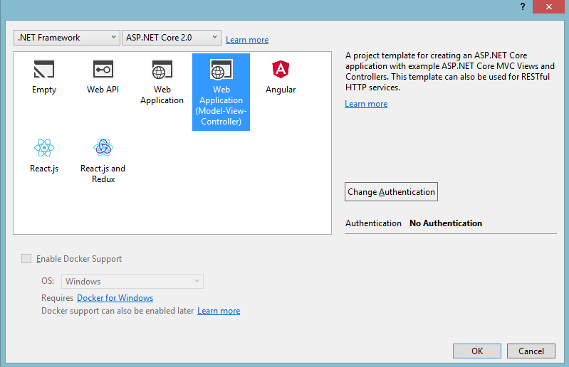

# Getting Started with ASP.NET Core Linear Gauge

## Prerequisites

To get started with the ASP.NET Core application, ensure the following software are installed on the machine.

* Visual Studio 2019
* DotNet Core 5.0

## Getting started with ASP.NET Core 5.0

### Create ASP.NET Core application

The following steps are used to create the ASP.NET Core Application.

**Step 1:** Open the Visual Studio and click the **File** menu and select **New -> Project** option.



**Step 2:** Select **ASP.NET Core Web Application** templates in Visual Studio 2019 and click **Next**.


**Step 3:** Change the application name and location of the application if necessary then click **Create**.


**Step 4:** Choose the .NET Core version as **ASP.NET Core 5.0** and select **ASP.NET Core Web App (Model-View-Controller)**, and then click **Create**. The web application project is now created with default ASP.NET Core template.


**Step 5**: Add the [`Syncfusion.EJ2.AspNet.Core`](https://www.nuget.org/packages/Syncfusion.EJ2.AspNet.Core/) NuGet package to the created application by using the Nuget Package Manager. Right-click the **dependencies** in the project and select the **Manage Nuget Packages** option.


**Step 6:** Install the **Syncfusion.EJ2.AspNet.Core** package to the application.


The EJ2 package will be added to the application after the installation is completed.

**Step 7:** Open the **~Views/ViewImports.cshtml** to import Syncfusion.EJ2 TagHelper.

```cs
@addTagHelper *, Syncfusion.EJ2
```

**Step 8:** Add the client side resources through [`CDN`](http://ej2.syncfusion.com/15.4.23/documentation/base/deployment.html?lang=typescript#cdn) or local [`package`](https://www.npmjs.com/package/@syncfusion/ej2) in the `<head>` element of the layout page **~/Views/Shared/_Layout.cshtml**.

```cs
<head>
    ....
    ....

    <!-- Syncfusion Essential JS 2 Styles -->
    <link rel="stylesheet" href="https://cdn.syncfusion.com/ej2/material.css" />

    <!-- Syncfusion Essential JS 2 Scripts -->
    <script src="https://cdn.syncfusion.com/ej2/dist/ej2.min.js"></script>
</head>
```

**Step 9:** Add the JS2 Script Manager at the end of the `<body>` element in the layout page **~/Views/Shared/_Layout.cshtml**.

```cs
<ejs-scripts></ejs-scripts>
```

**Step 10:** Add the below code to your **Index.cshtml** view page which is present under **Views/Home** folder, to initialize the Linear Gauge.

```cs
@using Syncfusion.EJ2.LinearGauge;
```

## Render LinearGauge

This section explains how to render default Linear Gauge.

```cs

public IActionResult Default()
{
    return View();
}

```

Add the `ejs-lineargauge` tag like below code snippet to create the Linear Gauge component.

```cs
@using Syncfusion.EJ2;

<ejs-lineargauge id="linear">
</ejs-lineargauge>
```

## Add Gauge Title

The title for the Linear Gauge can be rendered using the `title` property in the `ejs-lineargauge` tag.

```cs
@using Syncfusion.EJ2;

<ejs-lineargauge id="linear" title="Temperature Measure">
</ejs-lineargauge>
```

## Axis

The start value and end value of the Linear Gauge axis can be added using the `minimum` and `maximum` property in the `e-axis` tag.

Refer below code snippet to add the axis range to Linear Gauge.

```cs
<ejs-lineargauge id="linear" orientation="Horizontal">
    <e-lineargauge-axes>
        <e-lineargauge-axis minimum="0" maximum="200">
        </e-lineargauge-axis>
    </e-lineargauge-axes>
</ejs-lineargauge>
```