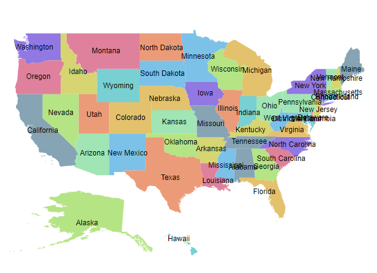
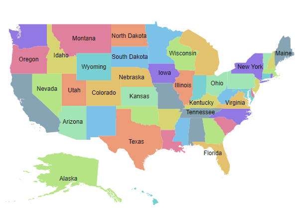

# Data labels in ##Platform_Name## Maps Component



Data labels provide information to users about the shapes of the Maps component. It can be enabled by setting the [visible](https://help.syncfusion.com/cr/aspnetcore-js2/Syncfusion.EJ2.Maps.MapsDataLabelSettings.html#Syncfusion_EJ2_Maps_MapsDataLabelSettings_Visible) property of the [dataLabelSettings](https://help.syncfusion.com/cr/aspnetcore-js2/Syncfusion.EJ2.Maps.MapsDataLabelSettings.html) to **true**.



Data labels provide information to users about the shapes of the Maps component. It can be enabled by setting the [Visible](https://help.syncfusion.com/cr/aspnetmvc-js2/Syncfusion.EJ2.Maps.MapsDataLabelSettings.html#Syncfusion_EJ2_Maps_MapsDataLabelSettings_Visible) property of the [DataLabelSettings](https://help.syncfusion.com/cr/aspnetmvc-js2/Syncfusion.EJ2.Maps.MapsDataLabelSettings.html) to **true**.



## Adding data labels



To display the data labels in the Maps, set the field name containing the text to be displayed from the data source or shape data in the [`labelPath`](https://help.syncfusion.com/cr/aspnetcore-js2/Syncfusion.EJ2.Maps.MapsDataLabelSettings.html#Syncfusion_EJ2_Maps_MapsDataLabelSettings_LabelPath) property of the `dataLabelSettings` property.

In the following example, the value of the `labelPath` property is set from the field name in the shape data of the Maps layer.












To display the data labels in the Maps, set the field name containing the text to be displayed from the data source or shape data in the [LabelPath](https://help.syncfusion.com/cr/aspnetmvc-js2/Syncfusion.EJ2.Maps.MapsDataLabelSettings.html#Syncfusion_EJ2_Maps_MapsDataLabelSettings_LabelPath) property of the `DataLabelSettings` property.

In the following example, the value of the `LabelPath` property is set from the field name in the shape data of the Maps layer.













In the following example, the value of `labelPath` property is set from the field name in the data source of the layer settings.












In the following example, the value of `LabelPath` property is set from the field name in the data source of the layer settings.











## Customization



The following properties are available in the `dataLabelSettings` to customize the data label of the Maps component.

* [border](https://help.syncfusion.com/cr/aspnetcore-js2/Syncfusion.EJ2.Maps.MapsDataLabelSettings.html#Syncfusion_EJ2_Maps_MapsDataLabelSettings_Border) - To customize the color, width and opacity for the border of the data labels in Maps.
* [fill](https://help.syncfusion.com/cr/aspnetcore-js2/Syncfusion.EJ2.Maps.MapsDataLabelSettings.html#Syncfusion_EJ2_Maps_MapsDataLabelSettings_Fill) - To apply the color of the data labels in Maps.
* [opacity](https://help.syncfusion.com/cr/aspnetcore-js2/Syncfusion.EJ2.Maps.MapsDataLabelSettings.html#Syncfusion_EJ2_Maps_MapsDataLabelSettings_Opacity) - To customize the transparency of the data labels in Maps.
* [textStyle](https://help.syncfusion.com/cr/aspnetcore-js2/Syncfusion.EJ2.Maps.MapsDataLabelSettings.html#Syncfusion_EJ2_Maps_MapsDataLabelSettings_TextStyle) - To customize the text style of the data labels in Maps.












The following properties are available in the `DataLabelSettings` to customize the data label of the Maps component.

* [Border](https://help.syncfusion.com/cr/aspnetmvc-js2/Syncfusion.EJ2.Maps.MapsDataLabelSettings.html#Syncfusion_EJ2_Maps_MapsDataLabelSettings_Border) - To customize the color, width and opacity for the border of the data labels in Maps.
* [Fill](https://help.syncfusion.com/cr/aspnetmvc-js2/Syncfusion.EJ2.Maps.MapsDataLabelSettings.html#Syncfusion_EJ2_Maps_MapsDataLabelSettings_Fill) - To apply the color of the data labels in Maps.
* [Opacity](https://help.syncfusion.com/cr/aspnetmvc-js2/Syncfusion.EJ2.Maps.MapsDataLabelSettings.html#Syncfusion_EJ2_Maps_MapsDataLabelSettings_Opacity) - To customize the transparency of the data labels in Maps.
* [TextStyle](https://help.syncfusion.com/cr/aspnetmvc-js2/Syncfusion.EJ2.Maps.MapsDataLabelSettings.html#Syncfusion_EJ2_Maps_MapsDataLabelSettings_TextStyle) - To customize the text style of the data labels in Maps.











## Smart labels



The Maps component provides an option to handle the labels when they intersect with the corresponding shape borders using the [smartLabelMode](https://help.syncfusion.com/cr/aspnetcore-js2/Syncfusion.EJ2.Maps.MapsDataLabelSettings.html#Syncfusion_EJ2_Maps_MapsDataLabelSettings_SmartLabelMode) property. The following options are available in the `smartLabelMode` property.

* **None** -  It specifies that no action is taken, when a label exceeds the shape's region.
* **Hide** -  It specifies to hide the labels, when it exceeds the shape's region.
* **Trim** -  It specifies to trim the labels, when it exceeds the shape's region.












The Maps component provides an option to handle the labels when they intersect with the corresponding shape borders using the [SmartLabelMode](https://help.syncfusion.com/cr/aspnetmvc-js2/Syncfusion.EJ2.Maps.MapsDataLabelSettings.html#Syncfusion_EJ2_Maps_MapsDataLabelSettings_SmartLabelMode) property. The following options are available in the `SmartLabelMode` property.

* **None** -  It specifies that no action is taken, when a label exceeds the shape's region.
* **Hide** -  It specifies to hide the labels, when it exceeds the shape's region.
* **Trim** -  It specifies to trim the labels, when it exceeds the shape's region.











## Intersect action



The Maps component provides an option to handle the labels when a label intersects with another label using the [intersectionAction](https://help.syncfusion.com/cr/aspnetcore-js2/Syncfusion.EJ2.Maps.MapsDataLabelSettings.html#Syncfusion_EJ2_Maps_MapsDataLabelSettings_IntersectionAction) property. The following options are available in the `intersectionAction` property.

* **None** -  It specifies that no action is taken, when the labels intersect.
* **Hide** -  It specifies to hide the labels when they intersect.
* **Trim** -  It specifies to trim the labels when they intersect.












The Maps component provides an option to handle the labels when a label intersects with another label using the [IntersectionAction](https://help.syncfusion.com/cr/aspnetmvc-js2/Syncfusion.EJ2.Maps.MapsDataLabelSettings.html#Syncfusion_EJ2_Maps_MapsDataLabelSettings_IntersectionAction) property. The following options are available in the `IntersectionAction` property.

* **None** -  It specifies that no action is taken, when the labels intersect.
* **Hide** -  It specifies to hide the labels when they intersect.
* **Trim** -  It specifies to trim the labels when they intersect.











## Adding data label as a template



Any HTML elements can be added as a template in the data labels by using the [template](https://help.syncfusion.com/cr/aspnetcore-js2/Syncfusion.EJ2.Maps.MapsDataLabelSettings.html#Syncfusion_EJ2_Maps_MapsDataLabelSettings_Template) property of `dataLabelSettings` in the Maps component.

N>The properties of data label such as, `smartLabelMode` `intersectionAction`, `border`, `fill`, `opacity` and `textStyle` properties are not applicable to `template` property. The styles can be applied to the label template using the CSS styles of the HTML element.












Any HTML elements can be added as a template in the data labels by using the [Template](https://help.syncfusion.com/cr/aspnetmvc-js2/Syncfusion.EJ2.Maps.MapsDataLabelSettings.html#Syncfusion_EJ2_Maps_MapsDataLabelSettings_Template) property of `DataLabelSettings` in the Maps component.

N>The properties of data label such as, `smartLabelMode` `intersectionAction`, `border`, `fill`, `opacity` and `textStyle` properties are not applicable to `Template` property. The styles can be applied to the label template using the CSS styles of the HTML element.











