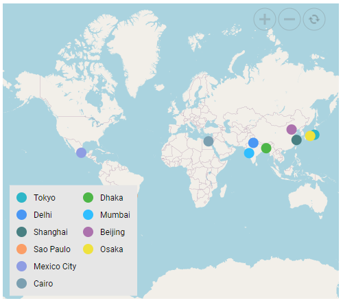

# OpenStreetMaps

The OpenStreetMap (OSM) is the online Maps provider built by a community of developers; it is free to use under an open license. It allows to view geographical data in a collaborative way from anywhere on the earth. The OSM Maps provides small tile images based on our requests and combines those images into a single image to display the Maps area in the Maps component.

## Adding OpenStreetMap

The OSM Maps can be rendered using the `UrlTemplate` property.
























### Changing the tile server of the OpenStreetMap

The OSM tile server can be changed by setting the tile URL in the `UrlTemplate` property. For more details about the OSM tile server, refer [here](https://wiki.openstreetmap.org/wiki/Tiles).

## Enabling zooming and panning

The OSM Maps layer can be zoomed and panned. Zooming helps to get a closer look at a particular area on a Maps for in-depth analysis. Panning helps to move a Maps around to focus the targeted area.
























## Adding markers and navigation line

Markers can be added to the layers of OSM Maps by setting the corresponding location's coordinates of latitude and longitude using `MarkerSettings`. Navigation lines can be added on top of an OSM Maps layer for highlighting a path among various places by setting the corresponding location's coordinates of latitude and longitude in the `NavigationLineSettings`.
























## Adding sublayer

Any GeoJSON shape can be rendered as a sublayer on top of the OSM Maps layer for highlighting a particular continent or country in OSM Maps by adding another layer and specifying the `Type` property of Maps layer to **SubLayer**.
























## Enabling legend

The legend can be added to the tile Maps by setting the `Visible` property of `MapsLegendSettings` to **true**.
























