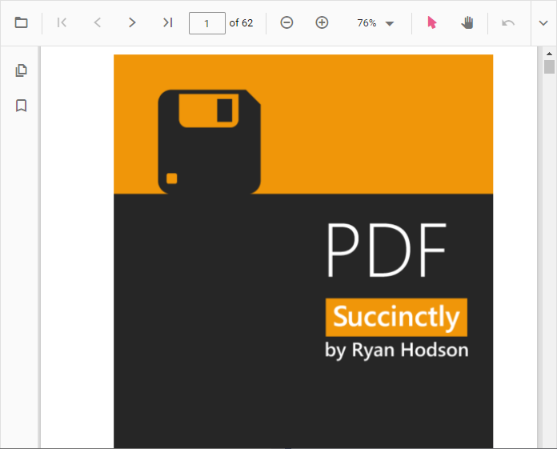

# Getting Started with ASP.NET MVC PDFViewer Control

The [ASP.NET MVC PDF Viewer](https://www.syncfusion.com/aspnet-mvc-ui-controls/pdf-viewer) control is used to viewing and printing PDF files in any web application. It provides the best viewing experience available with core interactions such as zooming, scrolling, text searching, text selection, and text copying. Thumbnail, bookmark, hyperlink and table of contents support provides easy navigation within and outside the PDF files. 

This section briefly explains about how to include ASP.NET MVC PDFViewer control in your ASP.NET MVC application using Visual Studio.

## Prerequisites

[System requirements for ASP.NET MVC controls](https://ej2.syncfusion.com/aspnetmvc/documentation/system-requirements)

## Create ASP.NET MVC application with HTML helper

* [Create a Project using Syncfusion ASP.NET MVC Extension](https://ej2.syncfusion.com/aspnetmvc/documentation/getting-started/project-template)

* **Steps to create a project using Microsoft template** 

1. Create a new ASP.NET MVC Web Applicatoin project. 

       
2. Select Web Application pattern (MVC) for the project. 


## Install the NuGet packages

To include the .NET Core PDF Viewer library into your ASP.NET MVC application, please install the below NuGet packages. 

* [Syncfusion.EJ2.PdfViewer.AspNet.Mvc5](https://www.nuget.org/packages/Syncfusion.EJ2.PdfViewer.AspNet.Mvc5/)
* [Syncfusion.EJ2.MVC5](https://www.nuget.org/packages/Syncfusion.EJ2.MVC5)

> If you create ASP.NET MVC application with MVC4 package, search for [Syncfusion.EJ2.MVC4](https://www.nuget.org/packages/Syncfusion.EJ2.MVC4) and then install it. 

## Add namespace

Add **Syncfusion.EJ2** namespace reference in `Web.config` under `Views` folder.

```
<namespaces>
    <add namespace="Syncfusion.EJ2"/>
</namespaces>
```

## Add style sheet

The theme is referred using CDN inside the `<head>` of `~/Views/Shared/_Layout.cshtml` file as follows,




<head>
    ...
    <!-- Syncfusion ASP.NET MVC controls styles -->
    <link rel="stylesheet" href="https://cdn.syncfusion.com/ej2/{{ site.ej2version }}/fluent.css" />
</head>




N> Checkout the [Themes topic](https://ej2.syncfusion.com/aspnetmvc/documentation/appearance/theme) to learn different ways (CDN, NPM package, and [CRG](https://ej2.syncfusion.com/aspnetmvc/documentation/common/custom-resource-generator)) to refer styles in ASP.NET MVC application, and to have the expected appearance for Syncfusion ASP.NET MVC controls.

## Add script reference

In this getting started walk-through, the required scripts are referred using CDN inside the `<head>` of `~/Views/Shared/_Layout.cshtml` file as follows,




<head>
    ...
    <!-- Syncfusion ASP.NET MVC controls scripts -->
    <script src="https://cdn.syncfusion.com/ej2/{{ site.ej2version }}/dist/ej2.min.js"></script>
</head>




## Register Syncfusion Script Manager

Open `~/Views/Shared/_Layout.cshtml` page and register the script manager `EJS().ScriptManager()` at the end of `<body>` in the ASP.NET MVC application as follows. 




<body>
...
    <!-- Syncfusion ASP.NET MVC Script Manager -->
    @Html.EJS().ScriptManager()
</body>




## Add ASP.NET MVC PDFViewer control

Now, add the Syncfusion ASP.NET MVC PDFViewer control in `~/Views/Home/Index.cshtml` page. You can load a PDF file in the PDF Viewer by specifying the document name in the DocumentPath property as below.






















In this code line,

*PdfViewer("pdfviewer")* refers to the PdfViewer component among the EJ components with id as "pdfviewer".

[ServiceUrl](https://help.syncfusion.com/cr/aspnetmvc-js2/Syncfusion.EJ2.PdfViewer.PdfViewer.html#Syncfusion_EJ2_PdfViewer_PdfViewer_ServiceUrl) is necessary to communicate with the server which also specifies the path of the controller. Here, PdfViewer is the name of the controller.

[DocumentPath](https://help.syncfusion.com/cr/aspnetmvc-js2/Syncfusion.EJ2.PdfViewer.PdfViewer.html#Syncfusion_EJ2_PdfViewer_PdfViewer_DocumentPath) is the property needed to load a PDF file in the PDF Viewer. The specified document must be placed inside the folder structure that matches with the path in the GetDocumentPath(string document) method inside the PdfViewerController.

Press <kbd>Ctrl</kbd>+<kbd>F5</kbd> (Windows) or <kbd>⌘</kbd>+<kbd>F5</kbd> (macOS) to run the app. Then, the Syncfusion ASP.NET MVC PDFViewer control will be rendered in the default web browser.



> [View Sample in GitHub](https://github.com/SyncfusionExamples/ASP-NET-MVC-Getting-Started-Examples/tree/main/PDFViewer/ASP.NET%20MVC%20Razor%20Examples).

> You can refer to our [ASP.NET MVC PDF Viewer](https://www.syncfusion.com/aspnet-mvc-ui-controls/pdf-viewer) feature tour page for its groundbreaking feature representations. You can also explore our [ASP.NET MVC PDF Viewer example](https://ej2.syncfusion.com/aspnetmvc/PdfViewer/Default#/material) to understand the core features of PDF Viewer.