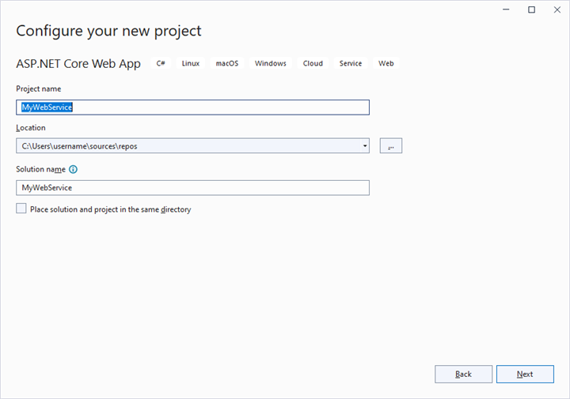
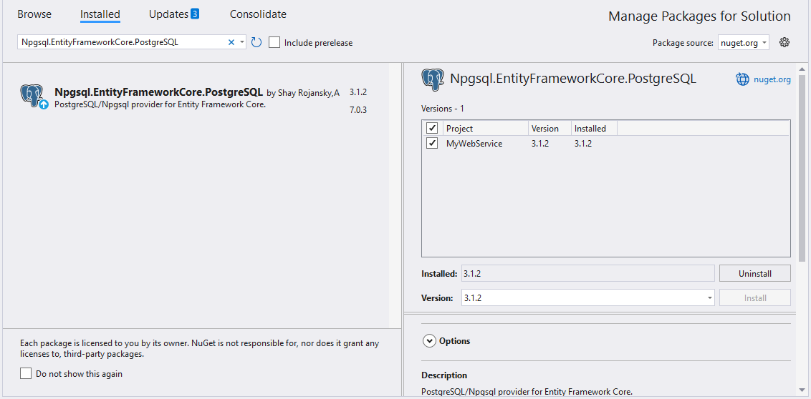

# PostgreSQL in EJ2 ASP.NET MVC Pivotview control

This section describes how to consume data from PostgreSQL database using [Microsoft Npgsql](https://www.npgsql.org/doc/index.html) and bind it to the Pivot Table via a Web API controller.

## Create a Web API service to fetch PostgreSQL data

**1.** Open Visual Studio and create an ASP.NET Core Web App project type, naming it **MyWebService**. To create an ASP.NET Core Web application, follow the document [link](https://learn.microsoft.com/en-us/visualstudio/get-started/csharp/tutorial-aspnet-core?view=vs-2022).



**2.** To connect a PostgreSQL Server using the **Npgsql** in our application, we need to install the [Npgsql.EntityFrameworkCore.PostgreSQL](https://www.nuget.org/packages/Npgsql.EntityFrameworkCore.PostgreSQL/) NuGet package. To do so, open the NuGet package manager of the project solution, search for the package **Npgsql.EntityFrameworkCore.PostgreSQL** and install it.



**3.** Create a Web API controller (aka, PivotController.cs) file under **Controllers** folder that helps to establish data communication with the Pivot Table.

**4.** In the Web API controller (aka, PivotController), **NpgsqlConnection** helps to connect the PostgreSQL database. Next, using **NpgsqlCommand** and **NpgsqlDataAdapter** you can process the desired PostgreSQL query string and retrieve data from the database. The **Fill** method of the **NpgsqlDataAdapter** is used to populate the retrieved data into a **DataTable** as shown in the following code snippet.

```csharp
    using Microsoft.AspNetCore.Mvc;
    using Newtonsoft.Json;
    using System.Data;
    using Npgsql;

    namespace MyWebService.Controllers
    {
        [ApiController]
        [Route("[controller]")]
        public class PivotController : ControllerBase
        {
            public dynamic GetPostgreSQLResult()
            {
                // Replace with your own connection string.
                NpgsqlConnection connection = new NpgsqlConnection("<Enter your valid connection string here>");
                connection.Open();
                NpgsqlCommand cmd = new NpgsqlCommand("SELECT * FROM tablename", connection);
                NpgsqlDataAdapter da = new NpgsqlDataAdapter(cmd);
                DataTable dt = new DataTable();
                da.Fill(dt);
                connection.Close();
                return dt;
            }
        }
    }

```

**5.** In the **Get()** method of the **PivotController.cs** file, the **GetPostgreSQLResult** method is used to retrieve the PostgreSQL data as a **DataTable**, which is then serialized into JSON using **JsonConvert.SerializeObject()**.

```csharp
    using Microsoft.AspNetCore.Mvc;
    using Newtonsoft.Json;
    using System.Data;
    using Npgsql;

    namespace MyWebService.Controllers
    {
        [ApiController]
        [Route("[controller]")]
        public class PivotController : ControllerBase
        {
            [HttpGet(Name = "GetPostgreSQLResult")]
            public object Get()
            {
                return JsonConvert.SerializeObject(GetPostgreSQLResult());
            }

            public dynamic GetPostgreSQLResult()
            {
                // Replace with your own connection string.
                NpgsqlConnection connection = new NpgsqlConnection("<Enter your valid connection string here>");
                connection.Open();
                NpgsqlCommand cmd = new NpgsqlCommand("SELECT * FROM tablename", connection);
                NpgsqlDataAdapter da = new NpgsqlDataAdapter(cmd);
                DataTable dt = new DataTable();
                da.Fill(dt);
                connection.Close();
                return dt;
            }
        }
    }

```

**6.** Run the application and it will be hosted within the URL `https://localhost:44378/`.

**7.** Finally, the retrieved data from PostgreSQL database which is in the form of JSON can be found in the Web API controller available in the URL link `https://localhost:44378/Pivot`, as shown in the browser page below.


## Connecting the Pivot Table to a PostgreSQL database using the Web API service

**1.** Create a simple ASP.NET MVC Pivot Table by following the **"Getting Started"** documentation [link](../getting-started).

**2.** Map the hosted Web API's URL link `https://localhost:44378/Pivot` to the Pivot Table component in **~/Views/Home/Index.cshtml** by using the [Url](https://help.syncfusion.com/cr/aspnetmvc-js2/Syncfusion.EJ2.PivotView.PivotViewDataSourceSettings.html#Syncfusion_EJ2_PivotView_PivotViewDataSourceSettings_Url) under [PivotViewDataSourceSettings](https://help.syncfusion.com/cr/aspnetmvc-js2/Syncfusion.EJ2.PivotView.PivotViewDataSourceSettingsBuilder.html) property.

```csharp
@Html.EJS().PivotView("PivotView").Height("300").DataSourceSettings(
     dataSource => dataSource.Url("https://localhost:44378/Pivot"
     )
     //Other codes here...
     ).Render()

```

**3.** Frame and set the report based on the data retrieved from the PostgreSQL database.

```csharp
@Html.EJS().PivotView("PivotView").Height("300").DataSourceSettings(
        dataSource => dataSource.Url("https://localhost:44378/Pivot"
        ).ExpandAll(false).EnableSorting(true)
    .Rows(rows =>
    {
        rows.Name("servicetype").Add(); rows.Name("servicecategory").Add();
    }).Columns(columns =>
    {
        columns.Name("openinghours_practice").Add(); columns.Name("closinghours_practice").Add();
    }).Values(values =>
    {
        values.Name("revenue").Add(); 
    })).ShowFieldList(true).Render()

```

When you run the sample, the resulting pivot table will look like this:


> Explore our ASP.NET MVC Pivot Table sample and ASP.NET Core Web Application to extract data from a PostgreSQL database and bind to the Pivot Table in [this](https://github.com/SyncfusionExamples/how-to-bind-PostgreSQL-database-to-pivot-table) GitHub repository.