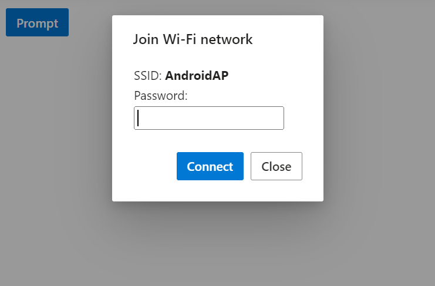
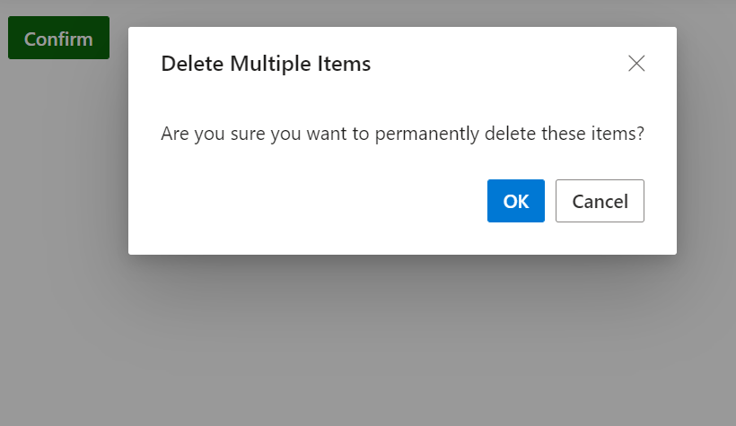
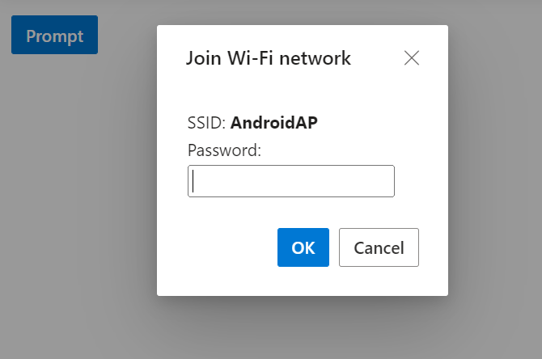

# Customization of Predefined Dialogs 

## Customize action buttons

You can customize the predefined dialogs buttons by using below properties.
* `okButton` - Use this property to customize **OK** button text and appearence.
* `cancelButton` - Use this property to customize **Cancel** button text and appearence.

Use the following code snippet for **Alert.cshtml**, **Confirm.cshtml** and **Prompt.cshtml** to customize the predefined dialog action buttons.

For alert dialog , customized the default dialog button content as `Done` by using the `okButton.text` property.

For confirm dialog, customized the default dialog buttons content as `Yes` and `No` by using the `okButton.text`and `cancelButton.text` property and also customized the dialog button icons by using `okButton.icon` property.

For prompt dialog , customized the default dialog buttons content as `Connect` and `Close` by using `okButton.text` and `cancelButton.text` property.

















**Results from the code snippet**

**Alert**

**Confirm**

**Prompt**

## Show or hide dialog close button 

When rendering the predefined dialogs through utility methods, You can close the dialog using the following ways. The default values of `closeOnEscape` and `showCloseIcon` is `false`.

* By pressing the escape key if the [closeOnEscape](https://ej2.syncfusion.com/documentation/api/dialog/#closeonescape) property is enabled.
* By clicking the close button if the [showCloseIcon](https://ej2.syncfusion.com/documentation/api/dialog/#showcloseicon) property is enabled.

You can also manually close the Dialogs by creating an instance to the dialog and call the [hide](https://ej2.syncfusion.com/documentation/api/dialog/#hide) method.

Use the following code for **alert**, **confirm** and **prompt** to demonstrates the different ways of hiding the utility dialog.

















**Results from the code snippet**

**Alert**

**Confirm**

**Prompt**

## Customize dialog content

You can load custom content in predefined dialogs using the `content` property.

Use the following code to customize the dialog content to render the custom TextBox component inside the prompt dialog to get the username from the user.









**Results from the code snippet**

