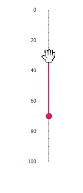

# Reversible Range Slider

You can create a Range Slider rendered with values in reverse order by setting the `min` property to the maximum value and the `max` property to the minimum value. An example of how to achieve a reversible Range Slider is shown below
























> Reversible order can be achieved with `Horizontal` orientation Range Slider by setting `enableRtl` as true.