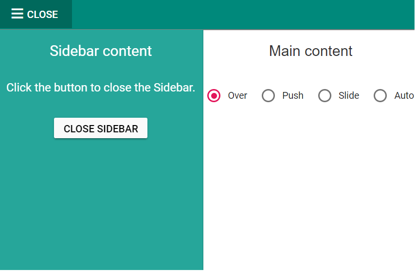

# Types

The Sidebar component's expand behaviour can be modified based on the purpose of use.

## Expanding types of Sidebar

The Sidebar can be set to initialize based on four different types that are consistent with the main component as explained below. When `dataBind` is invoked, this applies the pending property changes immediately to the component.

| Item    | Description                                                                                                                                                       |
| ------- | ----------------------------------------------------------------------------------------------------------------------------------------------------------------- |
| [`Over`](https://help.syncfusion.com/cr/aspnetcore-js2/Syncfusion.EJ2~Syncfusion.EJ2.Navigations.Sidebar~Type.html)  | Sidebar floats over the main content area.                                                                                                                    |
| [`Push`](https://help.syncfusion.com/cr/aspnetcore-js2/Syncfusion.EJ2~Syncfusion.EJ2.Navigations.Sidebar~Type.html)  | Sidebar pushes the main content area to appear side-by-side, and shrinks the main content within the screen width.                                            |
| [`Slide`](https://help.syncfusion.com/cr/aspnetcore-js2/Syncfusion.EJ2~Syncfusion.EJ2.Navigations.Sidebar~Type.html) | Sidebar translates the x and y positions of main content area based on the Sidebar width. The main content area will not be adjusted within the screen width. |
| [`Auto`](https://help.syncfusion.com/cr/aspnetcore-js2/Syncfusion.EJ2~Syncfusion.EJ2.Navigations.Sidebar~Type.html)  | Sidebar with [`Over`](https://help.syncfusion.com/cr/aspnetcore-js2/Syncfusion.EJ2~Syncfusion.EJ2.Navigations.Sidebar~Type.html) type in mobile resolution, and [`Push`](https://help.syncfusion.com/cr/aspnetcore-js2/Syncfusion.EJ2~Syncfusion.EJ2.Navigations.Sidebar~Type.html) type in other higher resolutions.                                                                       |

> [`Auto`](https://help.syncfusion.com/cr/aspnetcore-js2/Syncfusion.EJ2~Syncfusion.EJ2.Navigations.Sidebar~Type.html) is the default expand mode.

In the following sample, Sidebar component's expand behaviour are demonstrated.
























Output be like the below.

## See Also

* [How to add sidebar with custom animation](./how-to/sidebar-with-variation-animation)
* [How to add multiple sidebar](./how-to/multiple-sidebar)
