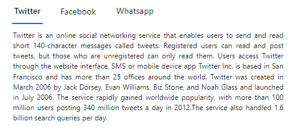

# Getting Started

 This section briefly explains about how to include a simple Tab in your ASP.NET Core application. You can refer [ASP.NET Core Getting Started documentation](../getting-started) page for introduction part of the system requirements and configure the common specifications.

## Adding component to the Application

* Now open your view and controller page to render Tab component like below.





Output be like the below.



## Initialize the Tab using JSON items collection

The Tab can be rendered by defining a JSON array. The item is rendered with [`header`](https://help.syncfusion.com/cr/cref_files/aspnetcore-js2/aspnetcore/Syncfusion.EJ2~Syncfusion.EJ2.Navigations.TabHeader~Text.html) text and [`content`](https://help.syncfusion.com/cr/cref_files/aspnetcore-js2/aspnetcore/Syncfusion.EJ2~Syncfusion.EJ2.Navigations.TabTabItem~Content.html) for each Tab.





## Initialize the Tab using HTML elements

The Tab component can be rendered based on the given HTML element using `id` as `target`.
Header section must be enclosed with in a wrapper element using `e-tab-header` class and corresponding content must be mapped with `e-content` class.
You need to follow the below structure of HTML elements to render the Tab,

```html

  <div id='ej2Tab'>   --> Root Tab element
    <div class="e-tab-header">      --> Tab header
       <div>   --> Header Item
       </div>
    </div>
    <div class="e-content">      --> Tab content
       <div>   --> Content Item
       </div>
    </div>
  </div>

```

* Add the HTML template data with its id attribute and add it in your `index.cshtml` file to initialize the Tab.





## See Also

* [How to load tab with DataSource](./how-to/load-tab-with-data-source/)