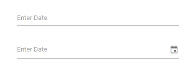

# Getting Started

This section briefly explains about how to include a simple Textbox in your ASP.NET Core application. You can refer [ASP.NET Core Getting Started documentation](../getting-started) page for introduction part part of the system requirements and configure the common specifications.

> Starting with v16.2.0.x, if you reference Syncfusion assemblies from trial setup or from the NuGet feed,
you also have to include the license key in your projects.
Please refer to this [link](https://help.syncfusion.com/common/essential-studio/licensing/license-key) to know about registering Syncfusion license key in your ASP.NET Core application to use our components.

## Initialize TextBox control to the Application

TextBox control can be rendered by using the `ejs-textbox` tag helper in ASP.NET Core application. Add the below simple code to your `index.cshtml` page which is available within the `Views/Home` folder, to initialize the TextBox.
























> Running the above code will display the basic TextBox on the browser.

## Adding icons to the TextBox

You can create a TextBox with icon as a group by creating the parent div element with the class `e-input-group` and add the icon element as span with the class `e-input-group-icon`. For detailed information, refer to the [Groups](./groups/) section.
























Output be like the below.

## Floating label

The floating label TextBox floats the label above the TextBox after focusing, or filled with value in the TextBox. You can create the floating label TextBox by using the [floatLabelType](https://help.syncfusion.com/cr/aspnetcore-js2/Syncfusion.EJ2.Inputs.TextBox.html#Syncfusion_EJ2_Inputs_TextBox_FloatLabelType) API
























## See Also

* [How to render TextBox programmatically](./how-to/add-textbox-programmatically)
* [How to add floating label to TextBox programmatically](./how-to/add-floating-label-to-textbox-programmatically)
