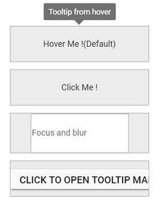
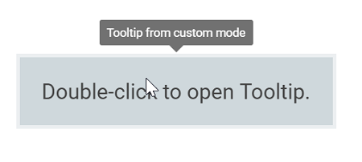
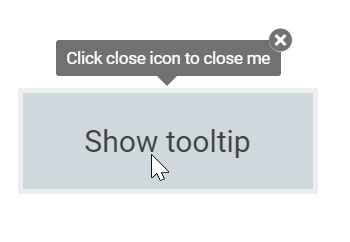
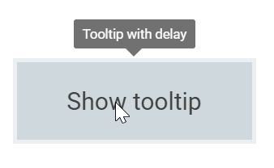

# Open Mode

You can decide the mode on which the Tooltip is to be opened on a page, i.e., on hovering, focusing, or clicking on the target elements.

> On mobile devices, Tooltips appear when you tap and hold the element, even if the `opensOn` option is assigned with `Hover`.
> Tooltips are also displayed as long as you continue to tap and hold the element. On lift, it  disappears in the next 1.5 seconds.
> If there is another action before that time ends, then the Tooltip disappears.

The `opensOn` property can take either a single or a combination of multiple values, separated by space from the following options.
 The table  below explains how the Tooltip opens on both desktop and mobile based on the value(s) assigned to the `opensOn` property.
  By default, it takes `Auto` value.

| Values | Desktop | Mobile |
| ------------- | ------------- | ------------- |
| `Auto` | Tooltip appears when you hover over the target or when the target element receives the focus. | Tooltip opens on tap and hold of the target element. |
| `Hover` | Tooltip appears when you hover over the target. | Tooltip opens on tap and hold of the target element. |
| `Click` | Tooltip appears when you click a target element. | Tooltip appears when you single tap the target element. |
| `Focus` | Tooltip appears when you focus (say through tab key) on a target element. | Tooltip appears with a single tap on the target element. |
| `Custom` | Tooltip is not triggered by any default action. So, you have to bind your own events and use either `open` or `close` public methods. | Same as Desktop. |

To open the Tooltip for multiple actions, say while hovering over or clicking on a target element, the `opensOn` property can be assigned
 with multiple values, separated by space as `Hover Click`.

> `Auto` value cannot be used with any combination for multiple values.

The following code example shows how to set the open mode for Tooltips.
























Output be like the below.

## Custom open mode

Other than the above specified options, the `Custom` mode makes the Tooltip appear on screen for user-defined custom actions such as
 `right-click`, `double-click`, and so on. Here, the tooltip is not triggered by any default action, and you have to bind your own events
  and use either `open` or `close` public methods to show or hide the Tooltips.

The following code example shows how to define custom open mode for the Tooltip.
























Output be like the below.

## Sticky mode

With this mode set to `true`, Tooltips can be made to show up on the screen as long as the close icon is pressed. In this mode, close
 icon is attached to the Tooltip located at the top right corner. This mode can be enabled or disabled using the `isSticky` property.
























Output be like the below.

## Open/Close Tooltip with delay

The Tooltips can be opened or closed after some delay by using the `openDelay` and `closeDelay` properties.
























Output be like the below.

