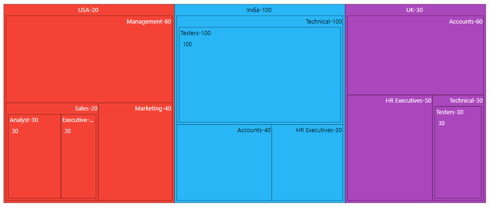

# Levels

TreeMap supports **n** number of levels and each level is separated by using the `groupPath` property.

<!-- markdownlint-disable MD036 -->

## Group path

The `groupPath` property is used to separate each level of the TreeMap by specifying the property from the data source.

In the following example, three levels are added and each level is configured using the `groupPath` property.
























<!-- markdownlint-disable MD036 -->

## Group gap

The `groupGap` property is used to separate an item from each group or another item to differentiate the levels mentioned in the TreeMap.
























<!-- markdownlint-disable MD036 -->

## Header format and Alignment

Customize header using the `headerFormat` property in which fields are mapping from the dataSource and align header using the `headerAlignment` property.
























## Header height and style

Customize the font color, family, weight, opacity and size using the `headerStyle`. Based on the font settings, the header height is given using the `headerHeight` property in `levels`.
























## Header template and position

The TreeMap header supports to customize header of each item using the `headerTemplate` property. It uses Essential JS2 Template engine to render the elements. You can position the template using the `templatePosition` property.
























