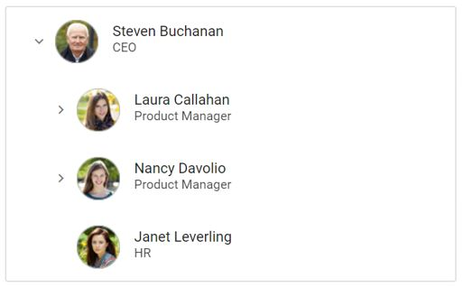

# Template

The TreeView control allows you to customize the look of TreeView nodes by using the [nodeTemplate](https://help.syncfusion.com/cr/aspnetcore-js2/Syncfusion.EJ2~Syncfusion.EJ2.Navigations.TreeView~NodeTemplate.html) property. This property accepts either `template string` or HTML element ID. 

In the following sample, employee information such as employee photo, name, and designation have been included using the `nodeTemplate` property. 

The template expression should be provided inside the `${...}` interpolation syntax.
























Output be like the below.

## See Also

* [How to customize the expand and collapse icons](./how-to/customize-the-expand-and-collapse-icons)
* [How to customize the tree nodes based on levels](./how-to/customize-the-tree-nodes-based-on-levels)