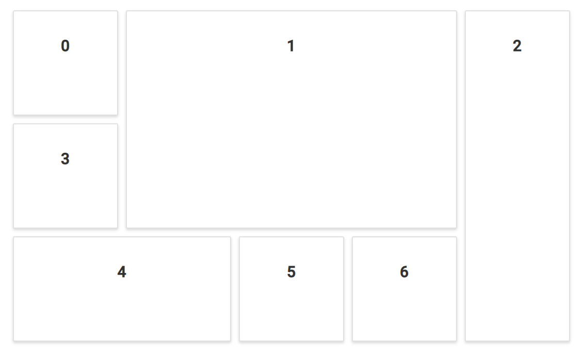
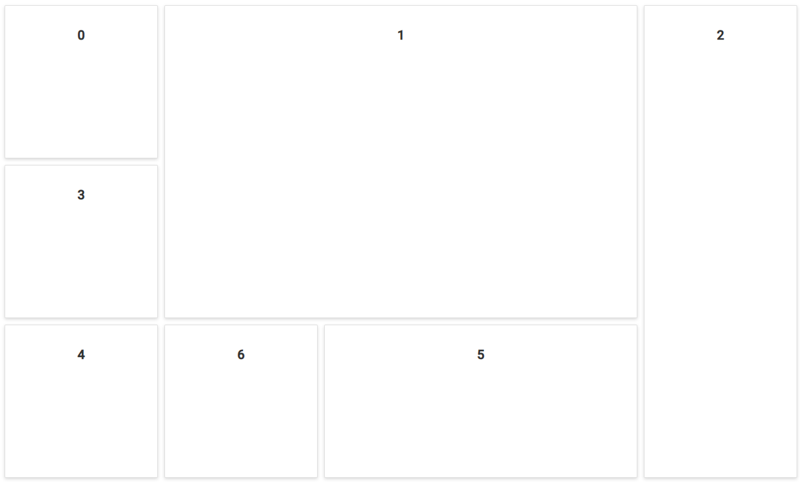

# Resizing of panels

The DashboardLayout component is also provided with the panel resizing functionality which can be enabled or disabled using the [`allowResizing`](https://help.syncfusion.com/cr/cref_files/aspnetcore-js2/Syncfusion.EJ2~Syncfusion.EJ2.Layouts.DashboardLayout~AllowResizing.html) property. This functionality allows you to resize the panels dynamically through UI interactions using the resizing handlers, which controls the panel resizing in various directions.

Initially, the panels can be resized only in south-east direction. However, panels can also be resized in east, west, north, south, and south-west directions by defining the required directions with the [`resizableHandles`](https://help.syncfusion.com/cr/cref_files/aspnetcore-js2/Syncfusion.EJ2~Syncfusion.EJ2.Layouts.DashboardLayout~ResizableHandles.html) property.

On resizing a panel in Dashboard layout the following events will be triggered,
* [resizeStart](https://help.syncfusion.com/cr/cref_files/aspnetcore-js2/Syncfusion.EJ2~Syncfusion.EJ2.Layouts.DashboardLayout~ResizeStart.html) - Triggers when panel resize starts
* [resize](https://help.syncfusion.com/cr/cref_files/aspnetcore-js2/Syncfusion.EJ2~Syncfusion.EJ2.Layouts.DashboardLayout~Resize.html) - Triggers when panel is being resized
* [resizeStop](https://help.syncfusion.com/cr/cref_files/aspnetcore-js2/Syncfusion.EJ2~Syncfusion.EJ2.Layouts.DashboardLayout~ResizeStop.html) - Triggers when panel resize stops

The following sample demonstrates how to enable and disable the resizing of panels in the DashboardLayout component in different directions.





Output be like the below.



## Resizing panels programatically

The Dashboard Layout panels can also be resized programatically by using `resizePanel` method. The method is invoked as follows,

```js
resizePanel(id, sizeX, sizeY)

```

Where,
* [`id`](https://help.syncfusion.com/cr/cref_files/aspnetcore-js2/Syncfusion.EJ2~Syncfusion.EJ2.Layouts.DashboardLayoutPanel~Id.html) - ID of the panel which needs to be resized.
* [`sizeX`](https://help.syncfusion.com/cr/cref_files/aspnetcore-js2/Syncfusion.EJ2~Syncfusion.EJ2.Layouts.DashboardLayoutPanel~SizeX.html) - New panel width in cells count for resizing the panel.
* [`sizeY`](https://help.syncfusion.com/cr/cref_files/aspnetcore-js2/Syncfusion.EJ2~Syncfusion.EJ2.Layouts.DashboardLayoutPanel~SizeY.html) - New panel height in cells count for resizing the panel.

The following sample demonstrates resizing panels programatically in the Dashboard Layout's [created](https://help.syncfusion.com/cr/cref_files/aspnetcore-js2/Syncfusion.EJ2~Syncfusion.EJ2.Layouts.DashboardLayout~Created.html) event.





Output be like the below.



> You can refer to our [ASP.NET Core Dashboard Layout](https://www.syncfusion.com/aspnet-core-ui-controls/dashboard-layout) feature tour page for its groundbreaking feature representations. You can also explore our [ASP.NET Core Dashboard Layout example](https://ej2.syncfusion.com/aspnetcore/DashboardLayout/DefaultFunctionalities#/material) to knows how to present and manipulate data.