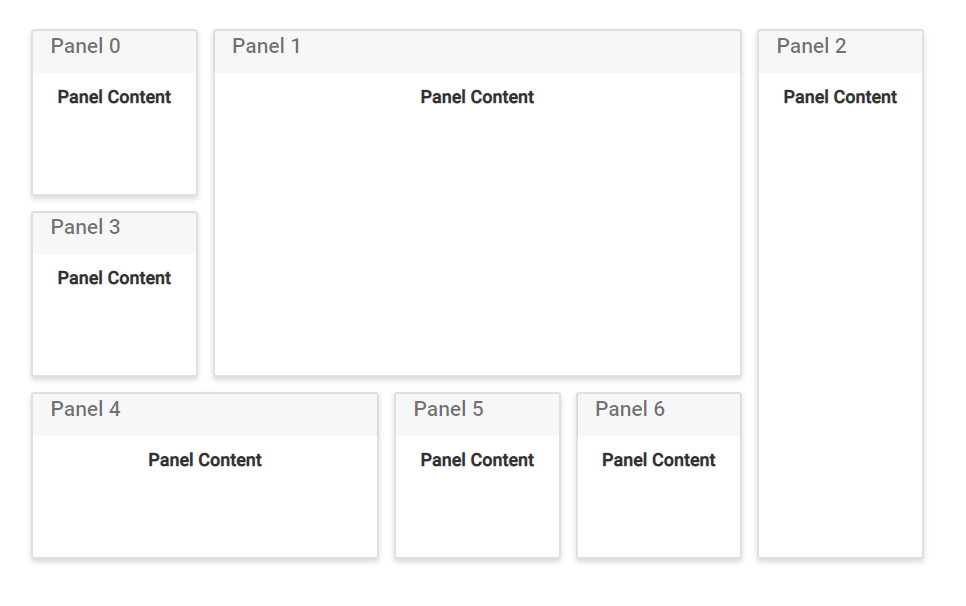

# Header and content of panels

The dashboard layout component is mostly used to represent the data used for monitoring or managing a process. These data or any HTML template can be placed as the [`content`](https://help.syncfusion.com/cr/cref_files/aspnetcore-js2/Syncfusion.EJ2~Syncfusion.EJ2.Layouts.DashboardLayoutPanel~Content.html) of a panel using the content property. Also, word or phrase that summarize the panel’s content can be added as the header on the top of each panel using the [`header`](https://help.syncfusion.com/cr/cref_files/aspnetcore-js2/Syncfusion.EJ2~Syncfusion.EJ2.Layouts.DashboardLayoutPanel~Header.html) property of the panel.

The following sample demonstrates how to add content for each panel using the header and content properties of the panels.





Output be like the below.

## Placing components as content

In a dashboard, components like charts, grids, maps, gauges, and more can be used to present complex data. Such components can be placed as the panel content by assigning the corresponding component element as the `content template` of the panel.

>Note: You must assign the empty div element inside the content template to add the component as content and also define the .e-panel, .e-panel-container, .e-panel-header, and .e-panel-content classes while rendering the DashboardLayout component using content template.

The following sample demonstrates how to add ej2-chart components as the [`content`](https://help.syncfusion.com/cr/cref_files/aspnetcore-js2/Syncfusion.EJ2~Syncfusion.EJ2.Layouts.DashboardLayoutPanel~Content.html) for each panel in the DashboardLayout component.





Output be like the below.

> You can refer to our [ASP.NET Core Dashboard Layout](https://www.syncfusion.com/aspnet-core-ui-controls/dashboard-layout) feature tour page for its groundbreaking feature representations. You can also explore our [ASP.NET Core Dashboard Layout example](https://ej2.syncfusion.com/aspnetcore/DashboardLayout/DefaultFunctionalities#/material) to knows how to present and manipulate data.