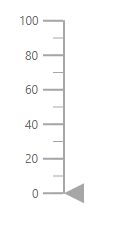
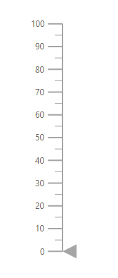

# Dimensions in ASP.NET Core Linear Gauge

<!-- markdownlint-disable MD036 -->

## Size for Linear Gauge

The height and width of the Linear Gauge can be set using the [`Height`](https://help.syncfusion.com/cr/aspnetcore-js2/Syncfusion.EJ2.LinearGauge.LinearGauge.html#Syncfusion_EJ2_LinearGauge_LinearGauge_Height) and [`Width`](https://help.syncfusion.com/cr/aspnetcore-js2/Syncfusion.EJ2.LinearGauge.LinearGauge.html#Syncfusion_EJ2_LinearGauge_LinearGauge_Width) properties in [`ejs-lineargauge`](https://help.syncfusion.com/cr/aspnetcore-js2/Syncfusion.EJ2.LinearGauge.LinearGauge.html).

### In Pixel

The size of the Linear Gauge can be set in pixel as demonstrated below.





### In Percentage

By setting value in percentage, Linear Gauge receives its dimension matching to its parent. For example, when the height is set as **50%**, Linear Gauge renders to half of the parent height. The Linear Gauge will be responsive when the width is set as **100%**.





>Note: When the component's size is not specified, the height will be **450px** and the width will be the same as the parent element's width.