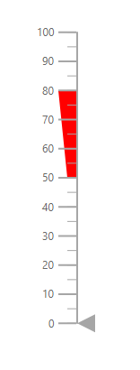
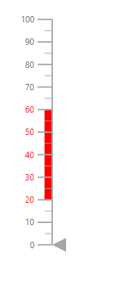

# Ranges in ASP.NET Core Linear Gauge

Range is the set of values in the axis. The range can be defined using the [`Start`](https://help.syncfusion.com/cr/aspnetcore-js2/Syncfusion.EJ2.LinearGauge.LinearGaugeRange.html#Syncfusion_EJ2_LinearGauge_LinearGaugeRange_Start) and [`End`](https://help.syncfusion.com/cr/aspnetcore-js2/Syncfusion.EJ2.LinearGauge.LinearGaugeRange.html#Syncfusion_EJ2_LinearGauge_LinearGaugeRange_End) properties in the [`e-lineargauge-range`](https://help.syncfusion.com/cr/aspnetcore-js2/Syncfusion.EJ2.LinearGauge.LinearGaugeRange.html). Any number of ranges can be added to the Linear Gauge using the [`e-lineargauge-ranges`](https://help.syncfusion.com/cr/aspnetcore-js2/Syncfusion.EJ2.LinearGauge.LinearGaugeRanges.html).





## Customizing the range

Ranges can be customized using the following properties in [`e-lineargauge-range`](https://help.syncfusion.com/cr/aspnetcore-js2/Syncfusion.EJ2.LinearGauge.LinearGaugeRanges.html).

* [`StartWidth`](https://help.syncfusion.com/cr/aspnetcore-js2/Syncfusion.EJ2.LinearGauge.LinearGaugeRange.html#Syncfusion_EJ2_LinearGauge_LinearGaugeRange_StartWidth) - Customize the range thickness at the start axis value.
* [`EndWidth`](https://help.syncfusion.com/cr/aspnetcore-js2/Syncfusion.EJ2.LinearGauge.LinearGaugeRange.html#Syncfusion_EJ2_LinearGauge_LinearGaugeRange_EndWidth) - Customize the range thickness at the end axis value.
* [`Color`](https://help.syncfusion.com/cr/aspnetcore-js2/Syncfusion.EJ2.LinearGauge.LinearGaugeRange.html#Syncfusion_EJ2_LinearGauge_LinearGaugeRange_Color) - Customize the range color.
* [`Position`](https://help.syncfusion.com/cr/aspnetcore-js2/Syncfusion.EJ2.LinearGauge.LinearGaugeRange.html#Syncfusion_EJ2_LinearGauge_LinearGaugeRange_Position) - To place the range. By default, the range is placed outside of the axis. To change the position, this property can be set as "[**Inside**](https://help.syncfusion.com/cr/aspnetcore-js2/Syncfusion.EJ2.LinearGauge.Position.html#Syncfusion_EJ2_LinearGauge_Position_Inside)", "[**Outside**](https://help.syncfusion.com/cr/aspnetcore-js2/Syncfusion.EJ2.LinearGauge.Position.html#Syncfusion_EJ2_LinearGauge_Position_Outside)", "[**Cross**](https://help.syncfusion.com/cr/aspnetcore-js2/Syncfusion.EJ2.LinearGauge.Position.html#Syncfusion_EJ2_LinearGauge_Position_Cross)", or "[**Auto**](https://help.syncfusion.com/cr/aspnetcore-js2/Syncfusion.EJ2.LinearGauge.Position.html#Syncfusion_EJ2_LinearGauge_Position_Auto)".
* [`Offset`](https://help.syncfusion.com/cr/aspnetcore-js2/Syncfusion.EJ2.LinearGauge.LinearGaugeRange.html#Syncfusion_EJ2_LinearGauge_LinearGaugeRange_Offset) - To place the range with specified distance from the axis.
* [`Border`](https://help.syncfusion.com/cr/aspnetcore-js2/Syncfusion.EJ2.LinearGauge.LinearGaugeRange.html#Syncfusion_EJ2_LinearGauge_LinearGaugeRange_Border) - Customize color and width of range border.





## Setting the range color for the labels

To set the color of the labels like the range color, set the [`UseRangeColor`](https://help.syncfusion.com/cr/aspnetcore-js2/Syncfusion.EJ2.LinearGauge.LinearGaugeLabel.html#Syncfusion_EJ2_LinearGauge_LinearGaugeLabel_UseRangeColor) property as **true** in the [`labelStyle`](https://help.syncfusion.com/cr/aspnetcore-js2/Syncfusion.EJ2.LinearGauge.LinearGaugeLabel.html).





## Multiple ranges

Multiple ranges can be added to the Linear Gauge by adding collections of [`e-lineargauge-range`](https://help.syncfusion.com/cr/aspnetcore-js2/Syncfusion.EJ2.LinearGauge.LinearGaugeRange.html) in the [`e-lineargauge-ranges`](https://help.syncfusion.com/cr/aspnetcore-js2/Syncfusion.EJ2.LinearGauge.LinearGaugeRanges.html) and customization of ranges can be done with [`e-lineargauge-range`](https://help.syncfusion.com/cr/aspnetcore-js2/Syncfusion.EJ2.LinearGauge.LinearGaugeRanges.html).





## Gradient Color

Gradient support allows the addition of multiple colors in the range. The following gradient types are supported in the Linear Gauge.

* Linear Gradient
* Radial Gradient

### Linear Gradient

Using linear-gradient, colors will be applied in a linear progression. The start value of the linear gradient can be set using the [`StartValue`](https://help.syncfusion.com/cr/aspnetcore-js2/Syncfusion.EJ2.LinearGauge.LinearGaugeLinearGradient.html#Syncfusion_EJ2_LinearGauge_LinearGaugeLinearGradient_StartValue) property. The end value of the linear gradient will be set using the [`EndValue`](https://help.syncfusion.com/cr/aspnetcore-js2/Syncfusion.EJ2.LinearGauge.LinearGaugeLinearGradient.html#Syncfusion_EJ2_LinearGauge_LinearGaugeLinearGradient_EndValue) property. The color stop values such as [`Color`](https://help.syncfusion.com/cr/aspnetcore-js2/Syncfusion.EJ2.LinearGauge.LinearGaugeColorStop.html#Syncfusion_EJ2_LinearGauge_LinearGaugeColorStop_Color), [`Opacity`](https://help.syncfusion.com/cr/aspnetcore-js2/Syncfusion.EJ2.LinearGauge.LinearGaugeColorStop.html#Syncfusion_EJ2_LinearGauge_LinearGaugeColorStop_Opacity), and [`Offset`](https://help.syncfusion.com/cr/aspnetcore-js2/Syncfusion.EJ2.LinearGauge.LinearGaugeColorStop.html#Syncfusion_EJ2_LinearGauge_LinearGaugeColorStop_Offset) to be defined in [`ColorStop`](https://help.syncfusion.com/cr/aspnetcore-js2/Syncfusion.EJ2.LinearGauge.LinearGaugeLinearGradient.html#Syncfusion_EJ2_LinearGauge_LinearGaugeLinearGradient_ColorStop).





## Radial Gradient

Using radial gradient, colors will be applied in circular progression. The inner circle position of the radial gradient will be set using the [`InnerPosition`](https://help.syncfusion.com/cr/aspnetcore-js2/Syncfusion.EJ2.LinearGauge.LinearGaugeRadialGradient.html#Syncfusion_EJ2_LinearGauge_LinearGaugeRadialGradient_InnerPosition) property. The outer circle position of the radial gradient can be set using the [`OuterPosition`](https://help.syncfusion.com/cr/aspnetcore-js2/Syncfusion.EJ2.LinearGauge.LinearGaugeRadialGradient.html#Syncfusion_EJ2_LinearGauge_LinearGaugeRadialGradient_OuterPosition) property. The color stop values such as [`Color`](https://help.syncfusion.com/cr/aspnetcore-js2/Syncfusion.EJ2.LinearGauge.LinearGaugeColorStop.html#Syncfusion_EJ2_LinearGauge_LinearGaugeColorStop_Color), [`Opacity`](https://help.syncfusion.com/cr/aspnetcore-js2/Syncfusion.EJ2.LinearGauge.LinearGaugeColorStop.html#Syncfusion_EJ2_LinearGauge_LinearGaugeColorStop_Opacity), and [`Offset`](https://help.syncfusion.com/cr/aspnetcore-js2/Syncfusion.EJ2.LinearGauge.LinearGaugeColorStop.html#Syncfusion_EJ2_LinearGauge_LinearGaugeColorStop_Offset) to be defined in [`ColorStop`](https://help.syncfusion.com/cr/aspnetcore-js2/Syncfusion.EJ2.LinearGauge.LinearGaugeRadialGradient.html#Syncfusion_EJ2_LinearGauge_LinearGaugeRadialGradient_ColorStop).





>If we set both gradients for the range, only the linear gradient gets rendered. If we set the [`StartValue`](https://help.syncfusion.com/cr/aspnetcore-js2/Syncfusion.EJ2.LinearGauge.LinearGaugeLinearGradient.html#Syncfusion_EJ2_LinearGauge_LinearGaugeLinearGradient_StartValue) and [`EndValue`](https://help.syncfusion.com/cr/aspnetcore-js2/Syncfusion.EJ2.LinearGauge.LinearGaugeLinearGradient.html#Syncfusion_EJ2_LinearGauge_LinearGaugeLinearGradient_EndValue) of the [`LinearGradient`](https://help.syncfusion.com/cr/aspnetcore-js2/Syncfusion.EJ2.LinearGauge.LinearGaugeLinearGradient.html) as empty strings, then the radial gradient gets rendered in the range of the Linear Gauge.